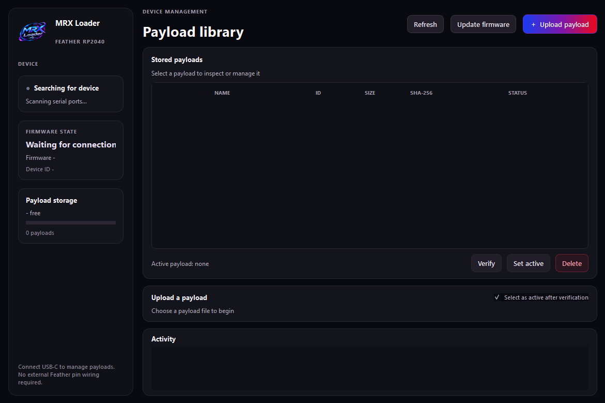

# MRX Loader

<p align="center"></p>

MRX Loader is firmware for the Adafruit Feather RP2040 USB Host (product 5723)
and a PySide6 desktop application. The Feather connects to a PC over USB-C for
management and uses its built-in USB-A host port when running standalone. No
external wiring or peripherals on the Feather pins are required.

Current development version: **0.1.0** for firmware and desktop application.
This is a development version, not a public release.

If you're Italian and want this guide in my language, since I'm an Italian
programmer, [click here](README-ita.md).

## Project origin

I've been working on MRX Loader since March 2026. The idea began when I found
an RCM loader priced at around €20, but its `payload.bin` could not be
configured. I wondered: why spend €20 on a device I could not customize, when
a similar amount could go toward something that stores multiple payloads and
lets me choose and manage them? That question became the starting point for
this project.

<p align="center"></p>

<div style="color: #e00020; border: 2px solid #e00020; padding: 12px; border-radius: 8px">
<strong>DISCLAIMER:</strong> I am not responsible for any damage to devices,
loss of data, corrupted or unusable hardware, failed payloads, legal issues, or
other consequences arising from building, modifying, flashing, or using this
project. Use it at your own risk, only with hardware and software you own or
are authorized to use, and follow the laws and terms that apply where you live.
This project is provided as-is, without warranty. The Switch does not provide a
reliable USB confirmation that a payload launched; when using Hekate, its screen
is the user-visible confirmation.
</div>

## Use, modification, and credit

You may use, copy, and modify MRX Loader, including for your own projects.
If you share or redistribute this project or a modified version, retain clear
credit to **MRX Loader and its original creator (the owner of this project)**,
keep existing copyright and third-party notices, and identify changes you made.
Do not present the original project or another person's contributions as your
own. This permission does not replace the third-party licenses reproduced near
the end of this README.

## What the project does

- Firmware exposes USB CDC management commands, stores payloads in LittleFS,
  verifies payloads with SHA-256, and supports the RP2040 ROM BOOTSEL update flow.
- The standalone loader validates the selected payload before enabling USB-A
  VBUS. GPIO18 is held LOW at startup; host support uses the board's built-in
  USB-A port. No accessories are connected to Feather pins.
- The desktop app discovers compatible devices and supports payload listing,
  upload, verification, selection, deletion, and guided UF2 firmware updates.
- RCM transfer is implemented as an explicit firmware path. USB cannot confirm
  that Hekate started after a successful transfer, so the LED does not claim an
  unverifiable success.

## Hardware verification status

Physical results recorded on real hardware:

- **Manual UF2 flash over ROM BOOTSEL.** The development UF2 was copied to the
  `RPI-RP2` drive, the board rebooted, and the CDC `GET_INFO` probe reported MRX
  Loader firmware 0.1.0.
- **Hekate launch through the standalone loader.** The USB-A RCM path was
  exercised with Hekate and Hekate started on the target. Because the Switch
  stops answering USB once execution begins, the Hekate screen is the
  user-visible confirmation of success.

Host-side and build-side results are recorded separately in
[Verification status](#verification-status). The development USB identity
`1209:0001` is a placeholder; obtain a project-specific PID before any public
release.

## Quick start

### 1. Build the firmware UF2

You need CMake, Ninja, Git, the Raspberry Pi Pico SDK (including its TinyUSB
submodule), and the Arm GNU Embedded toolchain.

Linux / macOS:

```bash
export PICO_SDK_PATH=/path/to/pico-sdk
cmake -S firmware -B firmware/build -G Ninja \
  -DPICO_BOARD=adafruit_feather_rp2040_usb_host \
  -DPICO_TOOLCHAIN_PATH=/path/to/arm-gnu-toolchain
cmake --build firmware/build --parallel
```

Windows (PowerShell):

```powershell
$env:PICO_SDK_PATH = 'C:\path\to\pico-sdk'
cmake -S firmware -B firmware/build -G Ninja `
  -DPICO_BOARD=adafruit_feather_rp2040_usb_host `
  -DPICO_TOOLCHAIN_PATH='C:\path\to\arm-gnu-toolchain'
cmake --build firmware/build --parallel
```

The UF2 is written to `firmware/build/mrx_loader.uf2`. The linker enforces a
1 MiB firmware region; LittleFS uses the remaining 7 MiB of RP2040 flash.

### 2. Run the desktop application

Python 3.10 or newer is required. The application itself is cross-platform and
runs on Windows and Linux from the same source.

Linux:

```bash
python3 -m venv .venv
. .venv/bin/activate
pip install -r tools/mrx_gui/requirements.txt
python -m tools.mrx_gui.app
```

Windows (PowerShell):

```powershell
py -3.11 -m venv .venv
.\.venv\Scripts\Activate.ps1
python -m pip install -r tools\mrx_gui\requirements.txt
python -m tools.mrx_gui.app
```

Connect the Feather to the PC through its USB-C device port. With no board
connected, the app opens in its disconnected state. The app prefers the
development VID/PID `1209:0001` and also probes other serial ports for the MRX
`GET_INFO` response, so identification does not depend on a specific USB
identity.

On Linux, your user account must be able to open the CDC device. If
permission errors appear, add a udev rule for the device or run the app with
sufficient privileges.

### 3. Flash the UF2

Connect the Feather over USB-C and choose **Update firmware** in the desktop
app. After confirming the image, the app requests BOOTSEL. Copy
`firmware/build/mrx_loader.uf2` to the root of the `RPI-RP2` drive and wait for
the drive to disappear. The RP2040 ROM bootloader performs the write; the
running firmware does not overwrite itself. If automatic BOOTSEL entry fails,
use the board's physical BOOTSEL procedure and copy a known-good UF2 manually.

### 4. Run the host test suites

```bash
python tools/test_mrx_protocol.py
python tools/test_mrx_gui_pty.py
```

`test_mrx_protocol.py` exercises protocol framing, recovery, desktop packet
parsing, storage and payload lifecycle against simulated flash, UF2 validation,
and the 1 MiB linker boundary. It compiles the maintained firmware C sources
directly and cannot verify hardware operation.

`test_mrx_gui_pty.py` drives the real desktop discovery worker against a fake
MRX device served over a pseudo-terminal. It runs on Linux and macOS and is
skipped on Windows, where pseudo-terminals are unavailable.

To run the separate USB CDC smoke probe against a physical Feather:

```bash
python tools/probe_mrx_cdc.py
```

## Table of contents

- [Quick start](#quick-start)
- [Build and first test](#build-and-first-test)
- [USB CDC smoke test](#usb-cdc-smoke-test)
- [Desktop application](#desktop-application)
- [Verification status](#verification-status)
- [Known limitations](#known-limitations)
- [Power architecture specification](#power-architecture-specification)
- [Protocol specification](#protocol-specification)
- [Storage architecture specification](#storage-architecture-specification)
- [Third-party license notices](#third-party-license-notices)

## Build and first test

### Requirements

Use the Raspberry Pi Pico SDK and ARM GCC toolchain. The Pico SDK's documented CMake flow uses `PICO_SDK_PATH` and `pico_sdk_init()`. If ARM GCC is not on `PATH`, set `PICO_TOOLCHAIN_PATH` to the toolchain root (the directory containing `bin/arm-none-eabi-gcc`). The project does not vendor the SDK.

The SDK checkout must include its TinyUSB submodule and support linker script overrides. Pico-PIO-USB 0.7.2 and LittleFS v2.11.3 are vendored under `firmware/third_party/`. CMake limits firmware linking to the first 1 MiB of flash and maps LittleFS over the remaining 7 MiB. Linking fails if the firmware exceeds its partition.

### Configure

```bash
export PICO_SDK_PATH=/path/to/pico-sdk
export PICO_TOOLCHAIN_PATH=/path/to/arm-gnu-toolchain
cmake -S firmware -B firmware/build -DPICO_BOARD=adafruit_feather_rp2040_usb_host \
  -DPICO_TOOLCHAIN_PATH="$PICO_TOOLCHAIN_PATH"
cmake --build firmware/build --parallel
```

The firmware enables TinyUSB host mode on root port 1 through Pico-PIO-USB. The
host task runs on Core 1, uses GPIO16 for D+ and GPIO17 for D−, and reports
host/device status through `mrx_usb_host_get_status()`. GPIO18 VBUS is held
LOW during startup and is not enabled by this phase. The Feather's USB-A
connector is on-board; no accessory wiring to the Feather pins is required.

For PowerShell, configure and build with:

```powershell
$env:PICO_SDK_PATH = 'C:\path\to\pico-sdk'
$env:PICO_TOOLCHAIN_PATH = 'C:\path\to\arm-gnu-toolchain'
cmake -S firmware -B firmware/build -DPICO_BOARD=adafruit_feather_rp2040_usb_host `
  -DPICO_TOOLCHAIN_PATH="$env:PICO_TOOLCHAIN_PATH"
cmake --build firmware/build --parallel
```

The resulting UF2 is generated in `firmware/build/`.
For the USB CDC `GET_INFO` handshake and physical-device check, see
[USB CDC smoke test](#usb-cdc-smoke-test).

### Payload manager

The firmware implements the payload lifecycle and CDC commands:
listing and reading metadata, transactional upload/abort, delete, select,
selected-payload query, and streaming SHA-256 verification. Uploads use
LittleFS `.uploading` sentinels, sequential chunk offsets, streamed hashing,
read-back verification, and atomic metadata/configuration commits.

### RCM implementation

A TinyUSB application class driver targets NVIDIA APX (`0955:7321`),
streams a verified selected payload from LittleFS in bounded chunks, and builds
the Tegra relocation stub with the ARM toolchain. RCM injection is an explicit
API (`mrx_rcm_inject_selected()`); it is not run during boot. With the current
4 KiB transfer framing and RCM command-length limit, the largest accepted
payload is 0x1FD58 bytes. The API reports the final control-transfer result as
unconfirmed because successful execution makes the target stop responding.
The documented Fusée Gelée sequence uses the bulk endpoints and oversized
endpoint `GET_STATUS` control request described in
[the vulnerability disclosure](https://misc.ktemkin.com/fusee_gelee_nvidia.pdf)
and its [reference launcher](https://github.com/Smeat/fusee-launcher/blob/master/fusee-launcher.py).

GPIO18/VBUS remains LOW at startup and the RCM API does not enable it. The
Feather and an RCM-mode target are required to validate enumeration, large
control transfers, and actual payload execution; the current build cannot
confirm those hardware behaviors.

### Standalone loader

At startup the loader initializes storage and validates the configured payload,
starts the PIO USB host on Core 1, then keeps VBUS LOW while it checks for a PC
connection. In normal boot mode it waits up to 750 ms for the USB-C device link;
with no PC connected it enters standalone mode. An explicit standalone boot
mode skips that discovery window. The host must be ready and a valid payload
must be selected before GPIO18 is driven HIGH. With no valid selection, VBUS
stays LOW and the NeoPixel shows the no-payload state.

The built-in NeoPixel uses GPIO20 for power and GPIO21 for data. Its PIO driver
runs on PIO1 to keep it separate from the USB host programs on PIO0. The loader
shows boot, PC, standalone waiting, device detection, RCM detection, injection,
storage error, no-payload, and failure states. After the RCM trigger, execution
is unconfirmed by USB, so the LED keeps the magenta injection pattern briefly
instead of claiming success or a definite failure. When Hekate launches, its
screen is the user-visible confirmation.

The current MRX protocol has no command for changing `boot_mode`. Normal
auto-detection works without changing the stored mode; configuring the explicit
skip-discovery mode from the future PC application needs a protocol extension.
Hardware behavior still needs testing on the Feather and an RCM-mode target.

### Protocol tests

The protocol suite runs with Python 3.10 or newer. It also compiles and runs the
firmware protocol implementation with a host GCC or Clang compiler when one is
available. The SDK build separately compiles the complete firmware for RP2040.

```bash
python tools/test_mrx_protocol.py
```

The suite checks CRC-16/CCITT-FALSE, packet encoding and parsing, stream
resynchronization, GET_INFO, unknown-command handling, safe GPIO startup,
GPIO18 staying disabled in `main.c`, and the generated 1 MiB linker region.
It also compiles the storage/configuration code against a simulated 8 MiB NOR
flash, including first format, config persistence and recovery, and incomplete
upload cleanup. The same harness exercises payload upload, SHA-256, metadata,
listing, selection, chunk reads, and deletion. The protocol harness also checks
invalid payload command layouts and a maximum-size `LIST_PAYLOADS` response
through a constrained CDC write buffer. With GCC it verifies that a link over
the firmware partition limit fails. Without a host C compiler, the C
implementation harness and linker overflow check are skipped while Python
conformance and CMake-generation checks still run.

The host suite does not replace testing on a Feather RP2040 USB Host board.
It cannot verify real USB enumeration, flash timing, power behavior, or
hardware wiring.

### Desktop application

The PySide6 desktop manager under `tools/mrx_gui/` discovers
MRX Loader boards over USB CDC, displays firmware/device/storage status, and
supports listing, uploading, verifying, selecting, and deleting payloads. The
application only uses commands implemented by the current firmware; it does
not expose the reserved `GET_LOG` or `REBOOT` commands.

Install Python 3.10 or newer, then follow the setup and launch instructions in
[Desktop application guide](#desktop-application). The GUI dependencies
are listed in `tools/mrx_gui/requirements.txt` (`PySide6` and `pyserial`). A
Feather running compatible firmware is needed to exercise the CDC workflow;
without the board, the application can still be opened and its disconnected
state reviewed.

### Integration validation

Host results and the hardware checks awaiting the Feather are tracked in
[Verification status](#verification-status). The host suite also checks the
desktop client's packet encoder and stream parser against the protocol v1 test
vectors.

### Firmware update and release readiness

`CMD_REBOOT` enters the RP2040 ROM BOOTSEL mode; the desktop application checks
UF2 structure, chip family, and the 1 MiB flash boundary before guiding the user
to copy the image to `RPI-RP2`. The firmware does not write over itself. See
the **Firmware update** section in
[Desktop application](#desktop-application).

Release gates, including the required USB PID and outstanding hardware checks,
are listed in [Before a public release](#before-a-public-release).


## USB CDC smoke test

The firmware exposes the MRX protocol as raw USB CDC bytes. Open the serial port
with DTR enabled, send a zero-data `CMD_GET_INFO` request, and expect a
CRC-valid `CMD_GET_INFO | 0x80` response with the same sequence number.
USB CDC ignores the selected baud rate.

### Host-side probe

Connect the Feather's USB-C device port to the PC and install pyserial if needed:

```powershell
python -m pip install pyserial
python tools/probe_mrx_cdc.py
```

The probe tries ports reporting VID `0x1209` and PID `0x0001`; if none match,
it checks the available serial ports. It validates framing, CRC, sequence,
protocol version, product and hardware strings, the zero-padded device ID, and
the USB serial descriptor when the operating system exposes it. The per-port
response timeout defaults to 500 ms and can be changed with `--timeout`.

The PID is a development placeholder as described in the [protocol specification](#protocol-specification); it must be
replaced with an assigned PID before public release.

### Hardware test procedure

1. Build and copy `firmware/build/mrx_loader.uf2` to the Feather in BOOTSEL
   mode.
2. Disconnect and reconnect the Feather in normal mode through USB-C.
3. Run the probe and confirm that `CDC GET_INFO handshake passed` is printed.
4. Disconnect USB-C, reconnect, and run the probe again. The new CDC session
   must accept a fresh packet without stale framing bytes from the prior
   connection. The host-side C harness separately tests a partial frame across
   a simulated disconnect and reconnect.

This procedure requires the physical Feather; host-side unit tests do not
claim to verify USB enumeration or electrical behavior.


## Desktop application

The PySide6 application discovers MRX Loader boards over USB CDC, checks the
protocol version, shows firmware and storage status, and manages stored payloads.
Uploads are streamed in protocol-sized chunks, SHA-256 checked, verified again
from device flash, and optionally selected as the active payload.

### Install

Linux:

```bash
python3 -m venv .venv
. .venv/bin/activate
pip install -r tools/mrx_gui/requirements.txt
```

Windows (PowerShell):

```powershell
py -3.11 -m venv .venv
.\.venv\Scripts\Activate.ps1
python -m pip install -r tools\mrx_gui\requirements.txt
```

### Run

```bash
python -m tools.mrx_gui.app
```

Connect the Feather's USB-C device connector to the PC. The application scans
serial ports automatically and prefers the development USB VID/PID
(`1209:0001`), while still probing other serial ports with the MRX `GET_INFO`
handshake.

On Linux, ensure your user can open the CDC device. If permission errors
appear, add a udev rule for the device or run the application with sufficient
privileges.

### Payload workflow

1. Choose **Upload payload** and select a `.bin`, `.payload`, or other file.
2. Keep **Select as active after verification** enabled to make the new payload
   the standalone payload.
3. The app uploads sequential chunks, asks firmware to commit and read back the
   payload, then runs `VERIFY_PAYLOAD` and confirms the selection.
4. The table shows the active payload, stored size, and SHA-256 prefix.

### Firmware update

1. Build or obtain an MRX Loader `.uf2` image for the RP2040.
2. Choose **Update firmware** while the Feather is connected over USB-C.
3. The app validates UF2 block structure, the RP2040 family ID, and the
   project's 1 MiB firmware address range before asking for confirmation.
4. After confirmation, the app requests BOOTSEL mode. In your file manager,
   copy the selected file to the root of the `RPI-RP2` drive.
5. Wait for that drive to disappear. The application searches for the Feather
   again and displays the firmware version reported by the reconnected board.

The running firmware does not write over itself. The RP2040 ROM bootloader
handles the UF2 flash operation. If automatic entry fails, use the Feather's
BOOTSEL procedure and copy a known-good UF2 manually. Do not unplug the board
while copying the file.

Protocol mismatch disables payload commands. The app does not claim to test
USB-host behavior or RCM execution; Hekate's screen on the Switch is the
user-visible confirmation that the payload launched.


## Power architecture specification

Document version: 1.0

---

### 1. Overview

The Adafruit Feather RP2040 USB Host (Model 5723) has three possible power sources and one controlled output. Understanding how these interact is essential to writing correct firmware for the MRX Loader.

Power sources:
- USB-C (from PC or USB power adapter)
- LiPo battery (3.7V, connected to JST connector)

Controlled output:
- USB-A VBUS (5V boost converter, controlled by GPIO 18)

The firmware must explicitly manage the controlled output. It must not assume any particular state of the controlled output at startup.

---

### 2. Power Source Hardware

#### 2.1 USB-C Power Input

The USB-C connector provides power to the Feather from a host PC, USB power adapter, or USB power bank.

When USB-C is connected:
- The system operates from USB-C power.
- The LiPo battery charges at up to 200 mA through the onboard LiPo charger.
- The RP2040 native USB peripheral is available for communication.

When USB-C is disconnected:
- The LiPo charger is inactive.
- If a LiPo battery is present, the system switches to battery power automatically.
- If no battery is present, the device is unpowered.

Power source switching between USB-C and LiPo is handled by hardware (the power management circuitry on the Feather). The firmware does not need to manage this. The transition is transparent to the RP2040.

#### 2.2 LiPo Battery

The Feather accepts standard 3.7V single-cell LiPo batteries via the JST connector.

The onboard charger is rated at 200 mA charging current. This is sufficient for use cases where the Feather is periodically connected to USB-C for charging.

The RP2040 and its peripherals operate at 3.3V. The onboard 3.3V regulator accepts the LiPo voltage directly (nominal 3.7V, range approximately 3.0V to 4.2V).

A LiPo battery is optional. The device can operate from USB-C power alone without a battery, but in that case it cannot function as a standalone device after the PC is disconnected.

The firmware has no direct access to the battery voltage through a dedicated ADC pin on this board. Battery state estimation is out of scope for the initial implementation.

---

### 3. USB Host VBUS Control

#### 3.1 Hardware

The Feather 5723 includes a TPS61023 boost converter that generates 5V from the available supply voltage. This 5V output is connected to the USB-A VBUS pin.

The TPS61023 enable pin is connected to GPIO 18 on the RP2040.

| GPIO 18 state | VBUS state         | Effect on connected device                |
|---------------|--------------------|--------------------------------------------|
| LOW (or input) | 5V OFF            | No power on USB-A, device disconnected     |
| HIGH           | 5V ON (up to 1 A) | USB device receives power, enumeration begins |

The boost converter output has a 500 mA resettable polyfuse on the VBUS line. Sustained currents above approximately 500 mA will cause the fuse to open and disconnect VBUS.

The Nintendo Switch draws approximately 100 mA in RCM mode before receiving a payload. This is well within the fuse rating.

#### 3.2 Firmware Control

GPIO 18 must be initialized as an output by the firmware at startup. The initial state must be LOW (VBUS disabled).

```c
// Required initialization sequence for USB Host VBUS
gpio_init(USB_HOST_VBUS_ENABLE_PIN);          // GPIO 18
gpio_set_dir(USB_HOST_VBUS_ENABLE_PIN, GPIO_OUT);
gpio_put(USB_HOST_VBUS_ENABLE_PIN, 0);        // Ensure VBUS starts disabled
```

Failing to initialize GPIO 18 as an output leaves it in a high-impedance input state. The TPS61023 may interpret this as an enable or disable depending on its internal pull-down. Always initialize explicitly.

#### 3.3 VBUS Sequencing

The firmware must follow this sequence when enabling USB Host VBUS:

```
1. PIO USB host stack initialized on Core 1
2. Wait for Core 1 to signal ready
3. Enable VBUS: gpio_put(USB_HOST_VBUS_ENABLE_PIN, 1)
4. Wait for USB device enumeration (polled via TinyUSB host task)
```

The firmware must not enable VBUS before the PIO USB host stack is initialized and running. Enabling VBUS before the stack is ready means the Switch will begin USB enumeration before the host is listening, and the enumeration will fail or time out.

When disabling USB Host (for example when entering PC-only mode or on error):

```
1. Disable VBUS: gpio_put(USB_HOST_VBUS_ENABLE_PIN, 0)
2. Wait at least 100 ms for the connected device to discharge and disconnect cleanly
3. Stop servicing the host stack (if transitioning mode)
```

The 100 ms delay allows the Switch's internal capacitors to discharge and prevents the Switch from seeing a partial disconnect/reconnect cycle.

#### 3.4 VBUS Hard Reset

Toggling GPIO 18 LOW then HIGH performs a hard reset of the USB Host port. This can be used to recover from a stuck or non-responsive device:

```
Disable VBUS (GPIO 18 LOW)
Wait 200 ms
Enable VBUS (GPIO 18 HIGH)
Re-run enumeration
```

The firmware should use this as the first recovery action when a USB host error or timeout occurs.

---

### 4. Power States

The firmware must handle three distinct power states. Each has different capabilities and required behaviors.

#### 4.1 PC Powered Mode

```
PC (USB-C) ---> Feather RP2040
                     |
              USB Host VBUS: OFF (GPIO 18 LOW)
```

**Entry condition:** The RP2040 detects that the USB device stack has been connected (VBUS detected on the USB-C side, USB enumeration from the PC succeeds).

**Exit condition:** USB-C disconnected, detected via USB device stack disconnect event.

**Firmware behavior:**
- USB device stack (TinyUSB, CDC) active on Core 0.
- MRX protocol communication with PC active.
- USB Host VBUS disabled (GPIO 18 LOW). The Switch cannot be connected during PC mode.
- NeoPixel indicates PC connected state.

**Rationale for keeping VBUS off during PC mode:** The user is actively configuring the device. Connecting the Switch simultaneously would be an unusual configuration and adds risk of accidental injection. VBUS can be explicitly enabled if a future configuration option requires it.

**Restrictions:** All payload operations, configuration changes, and firmware updates occur in this mode.

#### 4.2 Standalone Powered Mode

```
LiPo or USB power adapter
             |
             v
      Feather RP2040
             |
      USB Host (GPIO 18 HIGH when ready)
             |
             v
        USB-A connector
             |
         USB-C cable
             |
             v
     Nintendo Switch (RCM mode)
```

**Entry condition:** The RP2040 powers up and determines that no PC USB connection is present. The device configuration contains a valid selected payload.

**Exit condition:** Power removed.

**Firmware behavior:**
- USB device stack may remain initialized but is not actively used (no PC is present).
- Core 1 runs the PIO USB host stack.
- GPIO 18 is set HIGH to enable VBUS after the host stack is ready.
- The firmware waits for a USB device to connect on the USB-A port.
- When a device connects, it is enumerated and identified.
- If VID=0x0955 and PID=0x7321 are detected (Switch in RCM mode), injection proceeds.
- If a different device is detected, the firmware ignores it and continues waiting.
- NeoPixel indicates status throughout (waiting, injecting, success, error).

**Critical requirement:** All data required for injection (payload binary, configuration) must already be in flash before this mode is entered. No PC is available. No download is possible.

#### 4.3 Unpowered State

```
No USB-C
No LiPo
No external power
         |
         v
    Feather OFF
```

**Entry condition:** All power sources removed.

**Exit condition:** Any power source applied.

**Firmware behavior:** None. The RP2040 is not running.

**Flash behavior:** The external QSPI flash retains all data indefinitely with no power applied. Flash data retention is rated at a minimum of 20 years under normal conditions. No special action is required by the firmware to preserve flash contents when power is removed.

**Invariant:** Every firmware write to flash must be complete and consistent before the operation is considered done. The firmware must never assume that power will remain available long enough to complete a multi-step write sequence that cannot be recovered from if interrupted.

---

### 5. Power-On Sequence

When power is applied (from any source), the firmware executes the following sequence:

```
Power applied
      |
      v
RP2040 ROM bootloader runs (transparent to application)
      |
      v
Stage-2 bootloader runs (XIP setup, transparent to application)
      |
      v
Application entry point (main())
      |
      v
[BOOT state]
Initialize GPIO (including GPIO 18 = LOW, GPIO 16/17 for USB Host)
Initialize NeoPixel (indicate boot in progress)
      |
      v
[INITIALIZE state]
Initialize hardware (clocks, watchdog)
      |
      v
[LOAD_CONFIGURATION state]
storage_init()
storage_mount()   --> if fails: storage_format() then storage_mount()
config_load()
      |
      v
[VALIDATE state]
Validate selected_payload_id (see the Storage architecture specification, Section 8.3)
      |
      v
[IDLE state]
Check: is USB-C device connection active?
      |
    YES |    NO
      v       v
  [PC_MODE] [STANDALONE_MODE]
```

The firmware should target a startup time below 500 ms under normal conditions. The implementation must measure actual startup time during testing and must not depend on the 500 ms figure for functional correctness. LittleFS mounting, filesystem recovery, USB initialization, multicore synchronization, and future startup checks can all affect the actual time.

---

### 6. Firmware Behavior When Switch Connects

```
Standalone mode, VBUS enabled
          |
   Switch connected to USB-A
          |
          v
PIO USB host detects device connect event
          |
          v
TinyUSB host stack enumerates device
          |
          v
Check idVendor and idProduct:
     |               |
  0x0955:0x7321    anything else
     |               |
     v               v
  RCM detected    Log unknown device
                  Continue waiting
     |
     v
Load selected payload from flash
     |
     v
Execute RCM injection sequence
     |
   success | failure
     |          |
     v          v
 NeoPixel    NeoPixel
 GREEN       RED
 Log success Log error
     |          |
     v          v
  IDLE       IDLE (or retry, depending on error type)
```

The firmware must not attempt injection without first verifying that the selected payload is valid and readable. If the payload cannot be read at injection time (filesystem error, corrupt data), the firmware aborts the injection, signals an error, and does not attempt to recover by selecting a different payload.

---

### 7. Firmware Behavior When Switch Disconnects

If the Switch disconnects during injection, the injection is incomplete. The firmware must:

1. Abort the current injection.
2. Reset the USB host port (toggle GPIO 18).
3. Log the disconnect event.
4. Return to the waiting state.

If the Switch disconnects before injection begins, the firmware simply returns to the waiting state.

The firmware must not assume that disconnection during injection caused the Switch to boot. From the firmware's perspective, a disconnect is always an error or an interrupted session.

---

### 8. Firmware Behavior When Power Is Removed

The RP2040 has no mechanism to detect impending power removal with enough time to commit data. The firmware must therefore treat every write to flash as atomic and verifiable.

Rules:
- Never write a configuration that depends on a subsequent write to be consistent.
- Never mark a payload as valid before all data is written and verified.
- Never update selected_payload_id to reference a payload that has not yet been committed.

These rules mean that power can be removed at any point without leaving the device in an unrecoverable state. See the Storage architecture specification for the detailed recovery procedures.

---

### 9. NeoPixel Status Codes

The NeoPixel provides the only user-visible status output in standalone mode. The following color and pattern conventions are defined.

| State                      | Color     | Pattern        |
|----------------------------|-----------|----------------|
| Booting                    | White     | Slow pulse     |
| PC mode active             | Blue      | Solid          |
| Standalone, waiting        | Yellow    | Slow pulse     |
| USB device detected        | Cyan      | Fast pulse     |
| RCM detected               | Magenta   | Fast pulse     |
| Injection in progress      | Magenta   | Rapid flash    |
| Injection success          | Green     | Solid 3 s      |
| Injection failed           | Red       | Rapid flash    |
| Storage error              | Red       | Double blink   |
| No payload selected        | Orange    | Slow pulse     |
| Filesystem format running  | White     | Rapid flash    |

After injection success or failure, the firmware returns to the standalone waiting state and the NeoPixel returns to the waiting pattern.

**Note:** The exact GPIO for the NeoPixel on the Feather 5723 must be confirmed from the board schematic before implementing the LED driver. This document uses "NeoPixel" as the indicator without specifying the GPIO number.

---

### 10. Dual-Core Power and Initialization Constraint

The PIO USB host stack requires Core 1. Core 1 must be initialized after all other hardware setup is complete on Core 0. The initialization sequence must use a multicore synchronization primitive (such as a semaphore or the Pico SDK multicore FIFO) to ensure that:

1. Core 0 completes all critical initialization before Core 1 starts.
2. Core 1 signals Core 0 when the PIO USB host stack is ready.
3. Core 0 does not enable GPIO 18 (VBUS) until Core 1 signals readiness.

```
Core 0                          Core 1
  |                               |
  | storage_init()                |
  | config_load()                 |
  | determine_mode()              |
  |                               |
  | multicore_launch_core1()      |
  |      -------------------------|--->
  |                               |
  | (wait for ready signal)       | pio_usb_init()
  |                               | tuh_init()
  |                               | signal Core 0 ready
  |      <------------------------|
  |                               |
  | gpio_put(VBUS_PIN, 1)         |
  |                               | tuh_task() loop
  |                               |
  | (continue application loop)   |
```

Core 0 must not proceed to enabling VBUS without receiving the ready signal from Core 1. If Core 1 fails to initialize (signal not received within a timeout), the firmware must log an error, disable VBUS, and enter an error state.

---

### 11. GPIO Pin Assignment Summary

The following GPIO assignments are confirmed from the Adafruit Feather RP2040 with USB Type-A Host pinout documentation (learn.adafruit.com/adafruit-feather-rp2040-with-usb-type-a-host/pinouts).

| GPIO | Function                  | Direction | Notes                                    |
|------|---------------------------|-----------|------------------------------------------|
| 16   | USB Host D+               | PIO       | Pico-PIO-USB; do not use for other I/O   |
| 17   | USB Host D-               | PIO       | Pico-PIO-USB; do not use for other I/O   |
| 18   | USB Host VBUS enable      | Output    | HIGH = 5V on USB-A; LOW = VBUS off      |
| 20   | NeoPixel power enable     | Output    | HIGH = NeoPixel powered                  |
| 21   | NeoPixel data             | Output    | WS2812 data signal                       |

All five GPIO assignments are determined by the PCB hardware. No other GPIO may be used for these functions.

#### NeoPixel Initialization

The NeoPixel on the Feather 5723 requires two GPIO operations: powering the NeoPixel via GPIO 20, then driving the data signal via GPIO 21.

```c
// Required initialization sequence for NeoPixel
gpio_init(NEOPIXEL_POWER_PIN);              // GPIO 20
gpio_set_dir(NEOPIXEL_POWER_PIN, GPIO_OUT);
gpio_put(NEOPIXEL_POWER_PIN, 1);           // Enable NeoPixel power

// GPIO 21 is driven by the WS2812 PIO program or equivalent driver
// (see led.cpp for implementation)
```

GPIO 20 must be set HIGH before attempting to write to GPIO 21, or the NeoPixel will not respond.

## Protocol specification

Document version: 1.1

---

### 1. Design Principles

The MRX protocol is the complete communication contract between the PC application and the Feather firmware.

Design requirements:

- Binary, not text. Parsing overhead on the RP2040 must be minimal.
- Versioned. The PC and firmware must be able to detect a version mismatch and fail gracefully.
- Self-framing. A receiver must be able to detect the start of a packet in a byte stream without prior synchronization.
- Error-detecting. Every packet carries a checksum. Corrupt packets are rejected, not silently accepted.
- Request/response only. Version 1 is strictly synchronous: the PC sends one request and waits for one response. No pipelining, no server-initiated messages.
- Extensible. New commands can be added without breaking parsers that do not know them, as long as the packet structure remains the same.

---

### 2. Transport Layer

The MRX protocol runs over USB CDC (Communications Device Class). The Feather presents itself to the PC as a virtual serial port via TinyUSB.

USB CDC was chosen over custom HID or bulk endpoints for the following reasons:

- No kernel drivers required on Windows 10/11, Linux, or macOS.
- Universally supported by pyserial on the PC side.
- Simple byte-stream semantics that match the protocol framing model.
- No need to manage USB transfer sizes explicitly at the application layer.

The CDC interface carries raw bytes. There is no baud rate at the transport level (USB CDC ignores baud rate settings). The PC application must not set or depend on any baud rate value.

#### 2.1 USB Device Identification

The Feather firmware must present the following USB descriptors:

| Field                | Value                        | Notes                               |
|----------------------|------------------------------|-------------------------------------|
| idVendor             | 0x1209                       | pid.codes open-source VID           |
| idProduct            | 0x0001                       | Placeholder; register at pid.codes  |
| bcdDevice            | 0x0100                       | Device release 1.0                  |
| Manufacturer string  | "MRX Loader Project"         |                                     |
| Product string       | "MRX Loader"                 |                                     |
| Serial number string | Derived from RP2040 chip ID  | 16 hex characters                   |

**Note on VID/PID:** 0x1209 is the pid.codes open-source USB VID. A unique PID should be requested at https://pid.codes before public release. The placeholder 0x0001 must not be used in released firmware.

#### 2.2 PC-Side Discovery

The PC application locates the Feather by:

1. Enumerating all available serial ports using the OS serial port API or pyserial.
2. For each port that reports idVendor=0x1209 (or when VID/PID filtering is not available, for each port), attempting a connection.
3. Sending a GET_INFO request (Section 5.1).
4. Checking that the response contains the correct MAGIC bytes and that the product identifies as MRX Loader.
5. Using the first port that passes the check.

The discovery process must time out per port within 500 ms and must not leave ports open if the handshake fails.

---

### 3. Packet Structure

All MRX protocol communication uses a single unified packet structure for both requests and responses.

#### 3.1 Packet Layout

```
Offset  Size    Field       Description
------  ----    -----       -----------
0       4       MAGIC       Fixed bytes: 0x4D 0x52 0x58 0x21  ("MRX!")
4       1       CMD         Command code (see Section 4)
5       1       FLAGS       Packet flags (see Section 3.3)
6       2       SEQ         Sequence number, little-endian uint16
8       2       LENGTH      Length of DATA field in bytes, little-endian uint16
10      N       DATA        Payload (0 to MRX_MAX_DATA_SIZE bytes)
10+N    2       CRC16       CRC-16 over bytes 0 to (10+N-1), little-endian uint16
```

Total overhead per packet: 12 bytes.

#### 3.2 Size Limits

```c
// Magic bytes (4 bytes, fixed)
#define MRX_MAGIC_0  0x4D   // 'M'
#define MRX_MAGIC_1  0x52   // 'R'
#define MRX_MAGIC_2  0x58   // 'X'
#define MRX_MAGIC_3  0x21   // '!'

// Maximum number of bytes in the DATA field
#define MRX_MAX_DATA_SIZE    4096U

// Maximum total packet size including all overhead
#define MRX_MAX_PACKET_SIZE  (10U + MRX_MAX_DATA_SIZE + 2U)  // 4108 bytes

// Protocol version advertised in GET_INFO response
#define MRX_PROTOCOL_VERSION  1U
```

The DATA field size of 4096 bytes matches the LittleFS block size. UPLOAD_DATA has a 16-byte command header, so each packet carries up to 4080 bytes of payload data.

#### 3.3 FLAGS Byte

```
Bit 7-1:  Reserved, must be 0x00 in all v1 packets
Bit 0:    Reserved, must be 0x00 in all v1 packets
```

The FLAGS byte is included for future extensibility. All packets in protocol version 1 must set FLAGS to 0x00. A receiver should not reject a packet solely because FLAGS contains an unknown non-zero value, to permit forward compatibility.

#### 3.4 SEQ Field

The PC assigns a sequence number to each request starting at 0 and incrementing by 1 for each new request, wrapping from 65535 back to 0.

The Feather copies the SEQ value from the request into the corresponding response. This allows the PC to match each response to its originating request and detect out-of-order or duplicate responses.

For multi-packet upload sequences (UPLOAD_DATA), each packet has its own unique SEQ value.

#### 3.5 CRC-16 Calculation

The CRC-16 is calculated using the CRC-16/CCITT-FALSE algorithm:

```
Polynomial:  0x1021
Initial:     0xFFFF
Reflect in:  false
Reflect out: false
XOR out:     0x0000
```

The CRC covers all bytes of the packet from offset 0 through offset (10+N-1), inclusive. The CRC field itself (the last 2 bytes) is not included in the calculation.

The CRC is stored in little-endian byte order: low byte first, then high byte.

A packet is rejected without processing if the calculated CRC does not match the received CRC. The receiver does not send a NACK for a CRC failure; it silently discards the packet and waits for a retransmit or timeout at the PC side.

**Rationale for silent discard:** A NACK response to a corrupt packet would itself need to reference the corrupt packet's SEQ field, which may be garbage. Silent discard lets the PC's timeout mechanism handle the failure cleanly.

#### 3.6 Request vs Response Distinction

Response packets are distinguished from request packets by the CMD byte:

- Request CMD: bit 7 is 0 (values 0x01 to 0x7F)
- Response CMD: bit 7 is 1 (values 0x81 to 0xFF)

A response CMD is always the request CMD with bit 7 set:

```c
response_cmd = request_cmd | 0x80;
```

#### 3.7 Response DATA Layout

All response packets begin the DATA field with a STATUS byte:

```
Offset within DATA   Size   Field
--------------------  ----   -----
0                     1      STATUS   Status code (Section 4.3)
1                     N-1    PAYLOAD  Command-specific response data (may be 0 bytes)
```

If STATUS is not STATUS_OK, the PAYLOAD section may be empty or may contain an additional error detail byte, depending on the command.

---

### 4. Code Tables

#### 4.1 Command Codes

```
Code   Name                    Direction     Description
----   ----                    ---------     -----------
0x01   CMD_GET_INFO            PC->Feather   Request device and firmware information
0x02   CMD_GET_STATUS          PC->Feather   Request current device status
0x03   CMD_GET_LOG             PC->Feather   Request recent log entries

0x10   CMD_LIST_PAYLOADS       PC->Feather   List all stored payload IDs
0x11   CMD_GET_PAYLOAD_INFO    PC->Feather   Get metadata for a specific payload
0x12   CMD_UPLOAD_BEGIN        PC->Feather   Begin a payload upload transaction
0x13   CMD_UPLOAD_DATA         PC->Feather   Send one chunk of payload data
0x14   CMD_UPLOAD_END          PC->Feather   Finalize and commit an upload
0x15   CMD_UPLOAD_ABORT        PC->Feather   Abort an in-progress upload
0x16   CMD_DELETE_PAYLOAD      PC->Feather   Delete a stored payload
0x17   CMD_SELECT_PAYLOAD      PC->Feather   Set the active payload
0x18   CMD_GET_SELECTED        PC->Feather   Get the currently selected payload ID
0x19   CMD_VERIFY_PAYLOAD      PC->Feather   Recalculate and compare payload hash

0x20   CMD_REBOOT              PC->Feather   Reboot the device

0x30   CMD_FW_UPDATE_BEGIN     PC->Feather   Reserved for a future version
0x31   CMD_FW_UPDATE_DATA      PC->Feather   Reserved for a future version
0x32   CMD_FW_UPDATE_END       PC->Feather   Reserved for a future version
```

Response codes are the corresponding command code with bit 7 set (CMD | 0x80).

#### 4.2 FLAGS Values

```
Value   Name                  Description
-----   ----                  -----------
0x00    FLAGS_NONE            Standard packet (all v1 packets use this)
```

#### 4.3 Status Codes

The STATUS byte is the first byte of every response DATA field.

```
Code   Name                       Description
----   ----                       -----------
0x00   STATUS_OK                  Operation completed successfully
0x01   STATUS_ERR_GENERAL         Unspecified internal error
0x02   STATUS_ERR_NOT_FOUND       Payload or resource does not exist
0x03   STATUS_ERR_CORRUPT         CRC mismatch or magic mismatch on stored data
0x04   STATUS_ERR_FULL            Insufficient filesystem space
0x05   STATUS_ERR_INVALID_PARAM   Request data is malformed or out of range
0x06   STATUS_ERR_BUSY            Another operation is already in progress
0x07   STATUS_ERR_NO_SELECTION    No payload is currently selected
0x08   STATUS_ERR_VERSION         Protocol or format version mismatch
0x09   STATUS_ERR_IO              Flash or filesystem I/O failure
0x0A   STATUS_ERR_INCOMPLETE      Payload exists but is not marked as valid
0x0B   STATUS_ERR_ABORTED         Operation was explicitly aborted
0x0C   STATUS_ERR_UNKNOWN_CMD     Command code is not recognized
```

Unknown status codes must be treated as STATUS_ERR_GENERAL by the PC application.

---

### 5. Command Specifications

Each command is defined with its request DATA layout and response DATA layout. All integer fields are little-endian unless otherwise stated. Strings are UTF-8. Byte arrays are raw binary.

Notation:
- uint8, uint16, uint32, uint64: unsigned integers of the given width
- char[N]: fixed-size character array, null-terminated within the array
- bytes[32]: fixed-size byte array

---

#### 5.1 CMD_GET_INFO (0x01)

Requests device identification, firmware version, and protocol version. This is the discovery handshake command.

**Request DATA:** None (LENGTH = 0)

**Response DATA on STATUS_OK:**

```
Offset  Size    Field                  Description
------  ----    -----                  -----------
0       1       STATUS                 0x00 = STATUS_OK
1       1       protocol_version       MRX_PROTOCOL_VERSION (currently 1)
2       1       fw_version_major       Firmware major version
3       1       fw_version_minor       Firmware minor version
4       1       fw_version_patch       Firmware patch version
5       1       reserved               0x00
6       32      product_string         "MRX Loader", null-padded to 32 bytes
38      32      hw_string              "Feather RP2040 USB Host", null-padded
70      16      device_id              128-bit unique device ID (from RP2040 chip ID)
```

Total response DATA: 86 bytes

The PC application must check that `protocol_version` matches the version it was built against. If it does not match, the PC must display a version mismatch warning and disable all commands other than CMD_GET_INFO and CMD_REBOOT.

---

#### 5.2 CMD_GET_STATUS (0x02)

Requests current runtime status including device state, selected payload, and filesystem usage.

**Request DATA:** None (LENGTH = 0)

**Response DATA on STATUS_OK:**

```
Offset  Size    Field                  Description
------  ----    -----                  -----------
0       1       STATUS                 0x00 = STATUS_OK
1       1       device_state           Current firmware state (see below)
2       1       reserved               0x00
3       1       reserved               0x00
4       4       selected_payload_id    Currently selected ID; 0 = no selection
8       4       payload_count          Number of valid stored payloads
12      8       fs_free_bytes          LittleFS free space in bytes
20      8       fs_total_bytes         LittleFS total space in bytes
```

Total response DATA: 28 bytes

**Device state values:**

```
0x00   STATE_BOOTING         Firmware is still initializing
0x01   STATE_PC_MODE         Connected to PC, configuration mode active
0x02   STATE_STANDALONE      No PC connection, USB Host active
0x03   STATE_INJECTING       RCM injection in progress
0x04   STATE_ERROR           Unrecoverable error (see log for details)
```

---

#### 5.3 CMD_GET_LOG (0x03)

Requests the contents of the in-RAM log buffer. Log entries are not persisted to flash (see the Storage architecture specification, Section 3 note on logging).

**Request DATA:**

```
Offset  Size    Field        Description
------  ----    -----        -----------
0       2       max_bytes    Maximum bytes of log text to return (uint16, max 4000)
```

**Response DATA on STATUS_OK:**

```
Offset  Size    Field        Description
------  ----    -----        -----------
0       1       STATUS       0x00 = STATUS_OK
1       2       text_length  Number of bytes of log text following (uint16)
3       N       log_text     Log text, newline-separated entries, not null-terminated
```

Log text format (each line):

```
[LEVEL] message text\n
```

Where LEVEL is one of: INFO, WARN, ERROR, DEBUG.

If the log buffer contains more text than `max_bytes`, the oldest entries are omitted and only the most recent entries are returned. The returned text always starts at a line boundary.

---

#### 5.4 CMD_LIST_PAYLOADS (0x10)

Returns the IDs of all valid stored payloads. The PC uses this to populate the payload list, then fetches details for each ID using CMD_GET_PAYLOAD_INFO.

**Request DATA:** None (LENGTH = 0)

**Response DATA on STATUS_OK:**

```
Offset  Size    Field        Description
------  ----    -----        -----------
0       1       STATUS       0x00 = STATUS_OK
1       2       count        Number of payload IDs following (uint16)
3       4*N     ids          Array of uint32 payload IDs, N = count
```

Payloads with `UPLOADING` flag set are not included. Only complete, valid payloads are listed.

---

#### 5.5 CMD_GET_PAYLOAD_INFO (0x11)

Returns the full metadata for a single payload.

**Request DATA:**

```
Offset  Size    Field        Description
------  ----    -----        -----------
0       4       payload_id   ID of the payload to query (uint32)
```

**Response DATA on STATUS_OK:**

```
Offset  Size    Field        Description
------  ----    -----        -----------
0       1       STATUS       0x00 = STATUS_OK
1       4       payload_id   Confirmed payload ID (uint32)
5       4       flags        Payload flags (uint32, see the Storage architecture specification, Section 5.5)
9       8       size         Payload size in bytes (uint64)
17      32      sha256       SHA-256 hash of the payload binary
49      64      name         Payload name, null-terminated, UTF-8
```

Total response DATA: 113 bytes

**Response on failure:**

```
Offset  Size    Field        Description
------  ----    -----        -----------
0       1       STATUS       STATUS_ERR_NOT_FOUND or STATUS_ERR_CORRUPT
```

---

#### 5.6 CMD_UPLOAD_BEGIN (0x12)

Begins a payload upload transaction. Allocates a new payload ID and creates temporary storage on the filesystem.

**Request DATA:**

```
Offset  Size    Field          Description
------  ----    -----          -----------
0       8       expected_size  Expected total payload size in bytes (uint64)
8       1       name_length    Length of the name field in bytes (uint8, max 63)
9       N       name           Payload name, not null-terminated, N = name_length
```

The name must consist of printable ASCII characters only (0x20 to 0x7E). Characters outside this range, path separators (`/` and `\\`), and reserved filename characters (`: * ? " < > |`) are rejected with STATUS_ERR_INVALID_PARAM. Maximum name length is 63 bytes. The firmware appends a null terminator internally.

**Response DATA on STATUS_OK:**

```
Offset  Size    Field           Description
------  ----    -----           -----------
0       1       STATUS          0x00 = STATUS_OK
1       4       assigned_id     The new payload ID assigned for this upload (uint32)
```

**Response on failure:**

```
Offset  Size    Field        Description
------  ----    -----        -----------
0       1       STATUS       STATUS_ERR_FULL, STATUS_ERR_BUSY, or STATUS_ERR_INVALID_PARAM
```

STATUS_ERR_BUSY is returned if an upload is already in progress for any payload.

---

#### 5.7 CMD_UPLOAD_DATA (0x13)

Sends one chunk of payload data during an active upload transaction. Chunks must be sent sequentially, starting at offset 0, with no gaps.

**Request DATA:**

```
Offset  Size    Field          Description
------  ----    -----          -----------
0       4       payload_id     ID returned by CMD_UPLOAD_BEGIN (uint32)
4       4       reserved       Reserved, must be 0x00000000 in protocol v1
8       8       chunk_offset   Byte offset of this chunk within the payload (uint64)
16      N       chunk_data     Raw payload bytes (N = LENGTH - 16, max 4080)
```

The four bytes at offsets 4-7 are reserved and must be zero. Receivers must reject a non-zero reserved value with STATUS_ERR_INVALID_PARAM. The 16-byte command header therefore consists of the 4-byte payload ID, 4 reserved bytes, and 8-byte chunk offset, leaving at most 4080 bytes for chunk data (4096 - 16 = 4080). This clarification does not change the protocol wire version or packet size.

The firmware verifies that `chunk_offset` equals the total bytes written so far. If it does not, the firmware responds with STATUS_ERR_INVALID_PARAM and immediately discards the active upload. This follows the general rule below that any failed UPLOAD_DATA response means the partial upload has already been discarded.

**Response DATA on STATUS_OK:**

```
Offset  Size    Field           Description
------  ----    -----           -----------
0       1       STATUS          0x00 = STATUS_OK
1       8       bytes_received  Total bytes received so far for this upload (uint64)
```

**Response on failure:**

```
Offset  Size    Field        Description
------  ----    -----        -----------
0       1       STATUS       STATUS_ERR_NOT_FOUND, STATUS_ERR_IO,
                             STATUS_ERR_INVALID_PARAM, or STATUS_ERR_FULL
```

A failure response to CMD_UPLOAD_DATA means the upload has been internally aborted. The PC does not need to send CMD_UPLOAD_ABORT after receiving a non-OK status on this command. The partial payload has already been discarded.

---

#### 5.8 CMD_UPLOAD_END (0x14)

Finalizes an upload transaction. The firmware verifies the total size and SHA-256 hash, performs a post-write read-back verification, and commits the payload.

**Request DATA:**

```
Offset  Size    Field           Description
------  ----    -----           -----------
0       4       payload_id      ID of the upload to finalize (uint32)
4       8       expected_size   Expected total payload size in bytes (uint64)
12      32      expected_sha256 Expected SHA-256 hash of the complete payload
```

**Response DATA on STATUS_OK:**

```
Offset  Size    Field            Description
------  ----    -----            -----------
0       1       STATUS           0x00 = STATUS_OK
1       4       payload_id       Confirmed payload ID (uint32)
5       8       actual_size      Actual bytes stored (uint64)
13      32      actual_sha256    SHA-256 of the stored payload (verified)
```

The PC should display the `actual_sha256` to the user as confirmation.

**Response on failure:**

```
Offset  Size    Field        Description
------  ----    -----        -----------
0       1       STATUS       STATUS_ERR_CORRUPT (hash mismatch),
                             STATUS_ERR_IO (read-back failure),
                             STATUS_ERR_INVALID_PARAM (size mismatch),
                             or STATUS_ERR_NOT_FOUND
```

A non-OK response means the upload has been internally discarded. The partial or corrupt payload has been deleted.

---

#### 5.9 CMD_UPLOAD_ABORT (0x15)

Aborts an in-progress upload and discards all received data.

**Request DATA:**

```
Offset  Size    Field        Description
------  ----    -----        -----------
0       4       payload_id   ID of the upload to abort (uint32)
```

**Response DATA:**

```
Offset  Size    Field        Description
------  ----    -----        -----------
0       1       STATUS       STATUS_OK or STATUS_ERR_NOT_FOUND
```

STATUS_ERR_NOT_FOUND is returned if there is no active upload for the given ID. This can happen if the upload already failed or was already cleaned up.

---

#### 5.10 CMD_DELETE_PAYLOAD (0x16)

Deletes a stored payload. If the deleted payload is currently selected, the selection is cleared.

**Request DATA:**

```
Offset  Size    Field        Description
------  ----    -----        -----------
0       4       payload_id   ID of the payload to delete (uint32)
```

**Response DATA on STATUS_OK:**

```
Offset  Size    Field             Description
------  ----    -----             -----------
0       1       STATUS            0x00 = STATUS_OK
1       1       selection_cleared 1 if the selection was cleared; 0 otherwise
```

The PC application must update its UI when `selection_cleared` is 1, showing that no payload is currently selected.

**Response on failure:**

```
Offset  Size    Field        Description
------  ----    -----        -----------
0       1       STATUS       STATUS_ERR_NOT_FOUND or STATUS_ERR_IO
```

---

#### 5.11 CMD_SELECT_PAYLOAD (0x17)

Sets the active payload. The firmware validates the target payload before committing the selection to persistent configuration.

**Request DATA:**

```
Offset  Size    Field        Description
------  ----    -----        -----------
0       4       payload_id   ID of the payload to select (uint32)
```

**Response DATA:**

```
Offset  Size    Field        Description
------  ----    -----        -----------
0       1       STATUS       STATUS_OK, STATUS_ERR_NOT_FOUND,
                             STATUS_ERR_INCOMPLETE, or STATUS_ERR_IO
```

STATUS_ERR_INCOMPLETE is returned if the payload exists but is not marked as valid (VALID flag not set).

---

#### 5.12 CMD_GET_SELECTED (0x18)

Returns the ID of the currently selected payload.

**Request DATA:** None (LENGTH = 0)

**Response DATA on STATUS_OK:**

```
Offset  Size    Field            Description
------  ----    -----            -----------
0       1       STATUS           0x00 = STATUS_OK
1       4       selected_id      Currently selected payload ID (uint32); 0 = none
```

If `selected_id` is 0, no payload is selected. The PC application should treat this state the same as STATUS_ERR_NO_SELECTION for display purposes.

---

#### 5.13 CMD_VERIFY_PAYLOAD (0x19)

Instructs the firmware to recalculate the SHA-256 hash of a stored payload from flash and compare it against the hash stored in the payload's metadata. This is a read-only integrity check.

**Request DATA:**

```
Offset  Size    Field        Description
------  ----    -----        -----------
0       4       payload_id   ID of the payload to verify (uint32)
```

**Response DATA on STATUS_OK (verification passed):**

```
Offset  Size    Field            Description
------  ----    -----            -----------
0       1       STATUS           0x00 = STATUS_OK
1       1       match            1 = hashes match, 0 = hashes differ
2       32      stored_sha256    Hash from metadata.bin
34      32      actual_sha256    Hash recalculated from payload.bin
```

Total response DATA: 66 bytes

STATUS_OK with `match = 0` means the operation completed but the payload data is corrupt. STATUS_OK with `match = 1` means the payload is intact.

**Response on failure (operation could not complete):**

```
Offset  Size    Field        Description
------  ----    -----        -----------
0       1       STATUS       STATUS_ERR_NOT_FOUND, STATUS_ERR_CORRUPT,
                             or STATUS_ERR_IO
```

Note: CMD_VERIFY_PAYLOAD for a large payload takes several seconds because the firmware must read the entire payload from flash and compute SHA-256 in streaming chunks. The PC application must display a progress indication and must not time out before the operation completes. See Section 7.3 for timeout guidance.

---

#### 5.14 CMD_REBOOT (0x20)

Instructs the firmware to reboot the RP2040.

**Request DATA:**

```
Offset  Size    Field        Description
------  ----    -----        -----------
0       1       reboot_mode  0x00 = normal boot; 0x01 = reboot into USB bootloader (BOOTSEL)
```

**Response DATA:**

```
Offset  Size    Field        Description
------  ----    -----        -----------
0       1       STATUS       0x00 = STATUS_OK
```

The firmware sends the response before initiating the reboot. The PC application should close the connection immediately after receiving the response, because the USB connection will drop within approximately 100 ms.

When `reboot_mode = 0x01`, the firmware reboots the RP2040 into the built-in USB Mass Storage bootloader (using the `reset_usb_boot()` Pico SDK function), allowing a UF2 firmware file to be dropped onto the device for update. This is the mechanism for firmware updates.

Protocol v1 implements both modes. The firmware validates the one-byte request,
sends the success response, services TinyUSB for at least 100 ms so the response
can leave the CDC endpoint, then reboots. The PC application should validate a
UF2 image for RP2040 and the MRX 1 MiB firmware partition before requesting
BOOTSEL. The UF2 file is then copied to the `RPI-RP2` mass-storage volume. The
RP2040 ROM bootloader performs the flash write; the MRX firmware does not erase
or program its own running image.

---

#### 5.15 CMD_FW_UPDATE_BEGIN, CMD_FW_UPDATE_DATA, CMD_FW_UPDATE_END (0x30, 0x31, 0x32)

These commands remain reserved in protocol v1 and must return
`STATUS_ERR_UNKNOWN_CMD`. Firmware updates use `CMD_REBOOT` with
`reboot_mode = 0x01` and the RP2040 ROM's UF2 mass-storage bootloader instead.

A firmware version 1.x device must respond to these commands with STATUS_ERR_UNKNOWN_CMD.

---

### 6. Multi-Step Sequences

#### 6.1 Upload Sequence

The complete upload transaction requires the following packet exchange in order:

```
PC                                Feather
|                                      |
|-- CMD_UPLOAD_BEGIN ---------------->|
|<- CMD_UPLOAD_BEGIN | 0x80  ACK ------|   (assigned_id returned)
|                                      |
|-- CMD_UPLOAD_DATA [chunk 0] ------->|
|<- CMD_UPLOAD_DATA | 0x80  ACK ------|
|                                      |
|-- CMD_UPLOAD_DATA [chunk 1] ------->|
|<- CMD_UPLOAD_DATA | 0x80  ACK ------|
|                                      |
|   ... repeat for all chunks ...      |
|                                      |
|-- CMD_UPLOAD_END ------------------>|   (expected_size + expected_sha256)
|<- CMD_UPLOAD_END | 0x80  ACK -------|   (actual_size + actual_sha256)
|                                      |
```

If any step fails:
- On CMD_UPLOAD_DATA failure: the upload is already aborted internally. The PC logs the error and does not send CMD_UPLOAD_END.
- On CMD_UPLOAD_END failure: the partial upload is already discarded. The PC logs the error.

The PC must not send CMD_UPLOAD_ABORT after a failed CMD_UPLOAD_DATA or CMD_UPLOAD_END response; the cleanup has already been done.

The PC must send CMD_UPLOAD_ABORT if the user cancels the upload before CMD_UPLOAD_END has been sent and the firmware has not yet reported a failure.

#### 6.2 Select and Verify Sequence (Recommended PC Workflow)

After uploading a payload, the PC should perform the following sequence before allowing the user to configure standalone mode:

```
PC                                Feather
|                                      |
|-- CMD_VERIFY_PAYLOAD [id] -------->|
|<- CMD_VERIFY_PAYLOAD | 0x80 --------|   (match = 1 expected)
|                                      |
|-- CMD_SELECT_PAYLOAD [id] -------->|
|<- CMD_SELECT_PAYLOAD | 0x80 --------|   (STATUS_OK expected)
|                                      |
|-- CMD_GET_SELECTED ----------------->|
|<- CMD_GET_SELECTED | 0x80 ----------|   (selected_id = id, confirmation)
|                                      |
```

The final CMD_GET_SELECTED round-trip confirms that the selection was persisted to flash before the PC closes the session.

#### 6.3 Firmware Update Through BOOTSEL

The protocol v1 update path uses the RP2040 ROM bootloader rather than writing
the active firmware partition from the running application:

1. The PC validates every UF2 block, its RP2040 family ID, and that all flash
   targets stay inside `0x10000000` through `0x100FFFFF`.
2. The PC asks the user to confirm the firmware update.
3. The PC sends `CMD_REBOOT` with `reboot_mode = 0x01` and waits for the ACK.
4. The Feather disappears from CDC and appears as the `RPI-RP2` mass-storage
   volume.
5. The user copies the validated UF2 file to the volume root. The volume
   disappears when the ROM bootloader has accepted the file and rebooted.
6. The PC application rediscovers the Feather and checks the firmware version
   with `CMD_GET_INFO`.

If the volume does not appear or the copy cannot be completed, leave the board
in BOOTSEL and follow the manual UF2 recovery procedure. Protocol v1 does not
provide a dual-bank rollback mechanism; it relies on the RP2040 ROM bootloader
remaining available independently of the application firmware.

---

### 7. Session Lifecycle

#### 7.1 Connection

1. The Feather is connected via USB-C.
2. The OS creates a serial port entry.
3. The PC application discovers the port (Section 2.2).
4. The PC sends CMD_GET_INFO.
5. The Feather responds with device information.
6. The PC checks protocol_version. If it does not match, the PC displays a warning and limits available commands.
7. Normal operation begins.

#### 7.2 Disconnection

If the USB-C cable is disconnected while a transaction is in progress:

- The Feather does not receive a CMD_UPLOAD_ABORT or CMD_UPLOAD_END. The upload is considered abandoned.
- On the next boot (or if the Feather remained powered), the cleanup procedure (Storage architecture specification, Section 7.4) will detect and discard the incomplete upload.
- The Feather does not wait for a PC reconnection. If it was in standalone mode on power, it returns to standalone mode.

The PC application must handle serial port disconnection at any point without crashing. It should display a disconnection message and attempt to reconnect automatically.

#### 7.3 Timeout Values

The following timeout values govern PC-side behavior. These are guidance for the PC implementation; the firmware does not enforce these timeouts from its side.

| Situation                               | Timeout        | PC Action on Timeout           |
|-----------------------------------------|----------------|--------------------------------|
| Discovery handshake (per port)          | 500 ms         | Close port, try next           |
| Standard command response               | 5 seconds      | Log error, close connection    |
| CMD_UPLOAD_DATA response (per chunk)    | 10 seconds     | Abort upload, log error        |
| CMD_UPLOAD_END response                 | 60 seconds     | Log error, close connection    |
| CMD_VERIFY_PAYLOAD response             | 120 seconds    | Log error, close connection    |
| Post-reboot reconnect                   | 5 seconds      | Log error, do not retry        |

CMD_VERIFY_PAYLOAD and CMD_UPLOAD_END have long timeouts because they involve reading the entire payload from flash and computing SHA-256, which is time-consuming for large payloads. The PC must display a progress indication during these operations.

---

### 8. Error Handling

#### 8.1 Corrupt Packet (CRC Mismatch)

On the Feather side: the packet is silently discarded. The PC's command timeout handles recovery.

On the PC side: if a response CRC does not match, the PC discards the response and waits for a retransmit, then times out.

#### 8.2 Unknown Command

If the Feather receives a CMD code it does not recognize, it responds with:

```
CMD:    unknown_cmd | 0x80  (bit 7 set on the unknown code)
STATUS: STATUS_ERR_UNKNOWN_CMD
```

If the unknown_cmd | 0x80 produces a value that is also undefined, the Feather uses CMD = 0xFF as a generic unknown-command response.

#### 8.3 Busy State

If the Feather receives a new command while an upload is in progress (other than CMD_UPLOAD_DATA, CMD_UPLOAD_END, or CMD_UPLOAD_ABORT for the active upload), it responds with STATUS_ERR_BUSY. The PC must not send commands to a busy device except the three listed above.

#### 8.4 Framing Recovery

Because USB CDC is a byte stream, a partially received packet (for example, due to a software reset mid-transmission) leaves the receiver in an unsynchronized state. The framing recovery procedure is:

1. Scan the incoming byte stream for the 4-byte MAGIC sequence (0x4D 0x52 0x58 0x21).
2. Once MAGIC is found, read the remaining header fields and then the data and CRC.
3. If the CRC fails, discard the packet and continue scanning.

This scan-for-magic approach allows the receiver to resynchronize after any corruption without needing an explicit reset command.

---

### 9. Protocol Versioning

#### 9.1 Version Field

The protocol version is a single byte (`protocol_version`) returned in the CMD_GET_INFO response. It starts at 1.

#### 9.2 Backward Compatibility Rules

- A PC application built for protocol version N must refuse to operate against a device advertising version N+1 or higher.
- A PC application built for protocol version N must operate correctly against a device advertising version N (exact match).
- A firmware advertising protocol version N must accept commands from any PC application built for version N (exact match).
- Devices advertising protocol version N must respond to unknown commands with STATUS_ERR_UNKNOWN_CMD rather than crashing or hanging.

#### 9.3 Extension Strategy

New commands may be added to a future protocol version. The version byte in CMD_GET_INFO indicates which commands are available. The PC application must check the version before using commands that did not exist in earlier versions.

New optional fields may be appended to the end of existing request or response DATA structures in a minor revision without incrementing the protocol version, provided the LENGTH field allows the receiver to ignore them safely.

Mandatory structural changes to existing commands require a protocol version increment.

---

### 10. Protocol Constants Reference

```c
// Packet structure
#define MRX_MAGIC_0              0x4D
#define MRX_MAGIC_1              0x52
#define MRX_MAGIC_2              0x58
#define MRX_MAGIC_3              0x21
#define MRX_PROTOCOL_VERSION     1U
#define MRX_MAX_DATA_SIZE        4096U
#define MRX_MAX_PACKET_SIZE      4108U
#define MRX_HEADER_SIZE          10U
#define MRX_CRC_SIZE             2U

// Command codes (requests)
#define MRX_CMD_GET_INFO         0x01
#define MRX_CMD_GET_STATUS       0x02
#define MRX_CMD_GET_LOG          0x03

#define MRX_CMD_LIST_PAYLOADS    0x10
#define MRX_CMD_GET_PAYLOAD_INFO 0x11
#define MRX_CMD_UPLOAD_BEGIN     0x12
#define MRX_CMD_UPLOAD_DATA      0x13
#define MRX_CMD_UPLOAD_END       0x14
#define MRX_CMD_UPLOAD_ABORT     0x15
#define MRX_CMD_DELETE_PAYLOAD   0x16
#define MRX_CMD_SELECT_PAYLOAD   0x17
#define MRX_CMD_GET_SELECTED     0x18
#define MRX_CMD_VERIFY_PAYLOAD   0x19

#define MRX_CMD_REBOOT           0x20

#define MRX_CMD_FW_UPDATE_BEGIN  0x30
#define MRX_CMD_FW_UPDATE_DATA   0x31
#define MRX_CMD_FW_UPDATE_END    0x32

// Response bit mask
#define MRX_RESPONSE_BIT         0x80

// Status codes
#define MRX_STATUS_OK            0x00
#define MRX_STATUS_ERR_GENERAL   0x01
#define MRX_STATUS_ERR_NOT_FOUND 0x02
#define MRX_STATUS_ERR_CORRUPT   0x03
#define MRX_STATUS_ERR_FULL      0x04
#define MRX_STATUS_ERR_INVALID   0x05
#define MRX_STATUS_ERR_BUSY      0x06
#define MRX_STATUS_ERR_NO_SEL    0x07
#define MRX_STATUS_ERR_VERSION   0x08
#define MRX_STATUS_ERR_IO        0x09
#define MRX_STATUS_ERR_INCOMPLETE 0x0A
#define MRX_STATUS_ERR_ABORTED   0x0B
#define MRX_STATUS_ERR_UNKNOWN   0x0C

// Device state values (CMD_GET_STATUS)
#define MRX_STATE_BOOTING        0x00
#define MRX_STATE_PC_MODE        0x01
#define MRX_STATE_STANDALONE     0x02
#define MRX_STATE_INJECTING      0x03
#define MRX_STATE_ERROR          0x04

// Reboot modes (CMD_REBOOT)
#define MRX_REBOOT_NORMAL        0x00
#define MRX_REBOOT_BOOTLOADER    0x01
```


## Storage architecture specification

Document version: 1.0

---

### 1. Design Principles

The storage subsystem obeys three unconditional rules:

**Rule 1: The device must never assume it is connected to a PC.**
All persistent data must be readable and usable after an arbitrary power cycle with no PC present.

**Rule 2: Power loss at any point must not leave the device in a permanently broken state.**
An incomplete write must be detectable and recoverable at the next boot.

**Rule 3: The storage layer is an abstraction boundary.**
Everything above the storage layer is unaware of LittleFS, flash offsets, sectors, or pages. If LittleFS were replaced with a different filesystem, no code above the storage API would need to change.

---

### 2. Layered Architecture

```
Application code
        |
        v
Payload Manager     <-- payload_manager.h
        |
        v
Storage Manager     <-- storage.h
        |
        v
LittleFS
        |
        v
Block device driver (rp2040_flash_bd.c)
        |
        v
hardware/flash.h (Pico SDK)
        |
        v
RP2040 QSPI controller
        |
        v
8 MiB external QSPI flash
```

RCM code accesses payloads only through Payload Manager, never through Storage Manager directly. Configuration is accessed only through the config module (config.h), which uses Storage Manager internally.

---

### 3. Filesystem Directory Structure

```
/ (LittleFS root, begins at flash offset 0x100000)
|
+-- config/
|   |
|   +-- device.bin         (device configuration, binary format)
|
+-- payloads/
|   |
|   +-- 00000001/          (payload directory, ID formatted as 8-digit hex)
|   |   +-- metadata.bin   (payload metadata, binary format)
|   |   +-- payload.bin    (raw payload binary)
|   |
|   +-- 00000002/
|   |   +-- metadata.bin
|   |   +-- payload.bin
|   |
|   +-- ...
|
+-- system/
    |
    +-- filesystem.version (filesystem schema version file, binary format)
```

#### 3.1 Naming Conventions

Payload directories are named using the payload ID formatted as an 8-character, zero-padded lowercase hexadecimal string.

```
Payload ID 1    -> "00000001"
Payload ID 2    -> "00000002"
Payload ID 255  -> "000000ff"
```

This ensures consistent sorting and avoids ambiguity.

#### 3.2 Temporary Upload Files

During an active upload transaction, temporary files exist alongside the permanent files:

```
payloads/
  00000003/
    metadata.bin.uploading   (present only during active upload)
    payload.bin.uploading    (present only during active upload)
```

The `.uploading` suffix is a sentinel. The presence of any `.uploading` file in a payload directory means that directory contains an incomplete upload and must be discarded on next mount.

Final committed payload files never carry the `.uploading` suffix.

---

### 4. Binary Format: Device Configuration

File path: `/config/device.bin`

#### 4.1 Purpose

Stores the small set of critical, persistent device state. Written whenever device state changes. Must survive power loss and be recoverable.

#### 4.2 Binary Layout

All multi-byte integers are stored in little-endian byte order.

```
Offset  Size    Type        Field                  Description
------  ----    ----        -----                  -----------
0       4       uint8_t[4]  magic                  ASCII bytes "MRX!"
4       4       uint32_t    format_version         Schema version of this struct (currently 1)
8       4       uint32_t    config_write_count     Increments on every save (diagnostic counter)
12      16      uint8_t[16] device_id              128-bit unique device identifier
28      4       uint32_t    selected_payload_id    Active payload ID, 0 = no selection
32      1       uint8_t     boot_mode              See boot mode constants below
33      3       uint8_t[3]  reserved_0             Reserved, must be 0x00
36      4       uint32_t    next_payload_id        Next ID to assign during payload creation
40      4       uint32_t    flags                  See flags constants below
44      4       uint8_t[4]  reserved_1             Reserved, must be 0x00
48      4       uint32_t    crc32                  CRC-32 of bytes 0..47 (fields before this)
------
Total: 52 bytes
```

#### 4.3 Magic Value

The magic is the fixed byte sequence `4D 52 58 21` (`MRX!`). Although the
documented symbolic value is `0x4D525821`, magic bytes are stored in ASCII order;
all other multi-byte numeric fields remain little-endian. This avoids reversing
the byte sequence when serializing the magic as a little-endian integer.

```c
#define MRX_CONFIG_MAGIC  0x4D525821UL   // Bytes on disk: 4D 52 58 21 ("MRX!")
```

If the magic value does not match, the configuration is considered absent or corrupt. The firmware treats this the same as a missing configuration file and falls back to defaults.

#### 4.4 Format Version

```c
#define MRX_CONFIG_FORMAT_VERSION  1U
```

If `format_version` does not equal the value the firmware was compiled with, the firmware must reject the configuration as incompatible rather than interpreting it incorrectly. Future versions of the firmware may add a migration path.

#### 4.5 Boot Mode Constants

```c
#define MRX_BOOT_MODE_NORMAL        0x00   // Auto-detect PC or standalone
#define MRX_BOOT_MODE_STANDALONE    0x01   // Skip PC mode, go directly to USB host
```

Additional modes may be added in future format versions.

#### 4.6 Flags Constants

```c
#define MRX_CONFIG_FLAG_FS_INIT     (1UL << 0)  // Filesystem has been formally initialized
```

Remaining bits are reserved and must be 0.

#### 4.7 Selected Payload ID

A value of 0 means no payload is currently selected. The device will refuse to inject in standalone mode if `selected_payload_id` is 0.

A non-zero value is only trusted if the corresponding payload directory exists, contains a valid `metadata.bin`, and the metadata indicates the payload is complete. On boot, the firmware must validate this reference, not merely trust it.

#### 4.8 Next Payload ID

`next_payload_id` starts at 1 and increments each time a new payload is successfully created. It is never decremented. This ensures that payload IDs are unique across the lifetime of the device, even after deletions.

#### 4.9 CRC-32

CRC-32 uses the standard polynomial (0xEDB88320, reflected, matching the Ethernet/zip standard). The CRC is calculated over bytes 0 through 47 (the entire structure excluding the CRC field itself).

If the CRC does not match, the configuration is corrupt and the firmware falls back to defaults.

#### 4.10 Default Configuration

When no valid configuration exists:

```c
DeviceConfig defaults = {
    .magic               = MRX_CONFIG_MAGIC,
    .format_version      = MRX_CONFIG_FORMAT_VERSION,
    .config_write_count  = 0,
    .device_id           = { /* generated from RP2040 unique ID at first boot */ },
    .selected_payload_id = 0,
    .boot_mode           = MRX_BOOT_MODE_NORMAL,
    .reserved_0          = { 0, 0, 0 },
    .next_payload_id     = 1,
    .flags               = MRX_CONFIG_FLAG_FS_INIT,
    .reserved_1          = { 0, 0, 0, 0 },
    .crc32               = /* calculated */
};
```

The RP2040 provides a unique 64-bit chip ID via `pico_unique_board_id`. The device_id field uses this ID in the first 8 bytes, with the remaining 8 bytes zeroed.

---

### 5. Binary Format: Payload Metadata

File path: `/payloads/<hex-id>/metadata.bin`

#### 5.1 Purpose

Stores everything the firmware needs to know about a payload without reading the payload binary itself. Used by the payload manager to list payloads, validate selections, and serve information to the PC application.

#### 5.2 Binary Layout

All multi-byte integers are stored in little-endian byte order.

```
Offset  Size    Type        Field                  Description
------  ----    ----        -----                  -----------
0       4       uint8_t[4]  magic                  ASCII bytes "MRXz"
4       4       uint32_t    format_version         Schema version of this struct (currently 1)
8       4       uint32_t    payload_id             ID of this payload (matches directory name)
12      4       uint32_t    flags                  See payload flags constants below
16      8       uint64_t    payload_size           Size of payload.bin in bytes
24      32      uint8_t[32] sha256                 SHA-256 hash of the payload binary
56      64      char[64]    name                   Human-readable name, null-terminated UTF-8
120     4       uint32_t    reserved_0             Reserved, must be 0
124     4       uint32_t    crc32                  CRC-32 of bytes 0..123
------
Total: 128 bytes
```

#### 5.3 Magic Value

The metadata magic is the fixed byte sequence `4D 52 58 7A` (`MRXz`). Magic
bytes are stored in ASCII order; all other multi-byte numeric fields remain
little-endian.

```c
#define MRX_META_MAGIC  0x4D52587AUL   // Bytes on disk: 4D 52 58 7A ("MRXz")
```

#### 5.4 Format Version

```c
#define MRX_META_FORMAT_VERSION  1U
```

#### 5.5 Payload Flags

```c
#define MRX_PAYLOAD_FLAG_VALID      (1UL << 0)  // Payload is complete and verified
#define MRX_PAYLOAD_FLAG_UPLOADING  (1UL << 1)  // Upload in progress (must not use)
```

A payload is only usable if `VALID` is set and `UPLOADING` is clear.

Combinations and their meaning:

| VALID | UPLOADING | State                                                   |
|-------|-----------|--------------------------------------------------------|
| 0     | 1         | Upload in progress (normal during active upload)       |
| 1     | 0         | Complete and usable                                    |
| 0     | 0         | Should not exist; treat as corrupt                     |
| 1     | 1         | Should not exist; treat as corrupt                     |

#### 5.6 SHA-256 Hash

The SHA-256 hash is calculated over the entire payload binary content. It is stored in the metadata after verification at the end of a successful upload. It is used for:

- Post-upload integrity confirmation
- On-demand VERIFY_PAYLOAD command from the PC
- Selection validation on boot (optional, see Section 8.3)

The hash must be calculated by streaming the payload in chunks rather than loading it entirely into SRAM, because payloads may exceed available RAM (264 KB SRAM).

#### 5.7 Name Field

The name field is a null-terminated UTF-8 string of at most 63 printable characters. The final byte must always be 0x00. The name is derived from the filename supplied during upload and sanitized before storage. Characters outside printable ASCII range are replaced with underscores. Path separators and special characters are not permitted.

---

### 6. Binary Format: Filesystem Version File

File path: `/system/filesystem.version`

#### 6.1 Purpose

Marks that the filesystem was initialized by a known version of the firmware and stores the filesystem schema version. This allows future firmware versions to detect and handle filesystems created by older firmware.

#### 6.2 Binary Layout

```
Offset  Size    Type        Field              Description
------  ----    ----        -----              -----------
0       4       uint8_t[4]  magic              ASCII bytes "MRXf"
4       4       uint32_t    fs_schema_version  Filesystem layout version (currently 1)
8       4       uint32_t    reserved           Must be 0
12      4       uint32_t    crc32              CRC-32 of bytes 0..11
------
Total: 16 bytes
```

```c
#define MRX_FS_VERSION_MAGIC   0x4D525866UL   // "MRXf"
#define MRX_FS_SCHEMA_VERSION  1U
```

The filesystem-version magic is the fixed byte sequence `4D 52 58 66`
(`MRXf`). Magic bytes are stored in ASCII order; all other multi-byte numeric
fields remain little-endian.

---

### 7. Upload Transaction

Uploads are transactional. A payload only becomes active and usable after all of the following steps have completed successfully.

#### 7.1 Transaction States

```
IDLE
  |
  | UPLOAD_BEGIN received
  v
UPLOAD_ACTIVE
  |
  | (all chunks received)
  |
  | UPLOAD_END received
  v
VERIFYING
  |
  +---- verification failed ---> CLEANUP ---> IDLE (error reported)
  |
  +---- verification passed ---> COMMITTING ---> IDLE (success reported)
```

#### 7.2 Step-by-Step Procedure

**Step 1: UPLOAD_BEGIN**

The PC sends an UPLOAD_BEGIN command containing the intended payload size and name.

The storage layer:
1. Validates that the name is acceptable (printable, not too long).
2. Reads `next_payload_id` from the current configuration.
3. Constructs the directory path `/payloads/<hex-id>/`.
4. Creates the directory.
5. Creates `metadata.bin.uploading` with `flags = MRX_PAYLOAD_FLAG_UPLOADING`, `payload_size = 0`, `sha256 = all zeros`. The other fields are filled from the supplied name and assigned ID.
6. Opens `payload.bin.uploading` for writing.
7. Responds with the assigned payload ID.

At this point, if power is lost, only files with `.uploading` suffixes exist in the directory. These will be detected and discarded on next boot.

**Step 2: UPLOAD_DATA (repeated)**

The PC sends data chunks. Each chunk is written sequentially to `payload.bin.uploading`. A running SHA-256 hash context is updated with each chunk. The hash context is held in SRAM, not in flash.

If any chunk write fails, the upload is aborted:
1. Close and delete `payload.bin.uploading`.
2. Delete `metadata.bin.uploading`.
3. Delete the payload directory.
4. Report an error to the PC.

**Step 3: UPLOAD_END**

The PC signals that all data has been sent, providing the expected total size and expected SHA-256 hash.

The firmware:
1. Flushes and closes `payload.bin.uploading`.
2. Verifies that the actual bytes written equals the expected size.
3. Finalizes the running SHA-256 context to get the actual hash.
4. Compares the actual hash with the expected hash.
5. If either check fails: delete all files in the directory, delete the directory, report error, return.
6. Reads back the stored payload in chunks and recalculates the SHA-256 hash from flash to confirm the written data is not corrupt. This is the post-write verification.
7. If the read-back hash does not match: delete all files in the directory, delete the directory, report error, return.
8. Rename `payload.bin.uploading` to `payload.bin` (atomic in LittleFS).
9. Update `metadata.bin.uploading`: set `flags = MRX_PAYLOAD_FLAG_VALID`, set `payload_size` to actual size, set `sha256` to the verified hash, recalculate CRC-32.
10. Rename `metadata.bin.uploading` to `metadata.bin` (atomic in LittleFS).
11. Increment `next_payload_id` in the device configuration and save.
12. Report success to the PC with the assigned ID, size, and hash.

#### 7.3 Power Loss During Upload

If power is lost at any point during Steps 1 through 3, one of the following is true at the next boot:

- The directory does not exist: nothing to clean up.
- The directory exists but contains only `.uploading` files: detected as an incomplete upload, discarded.
- `payload.bin` exists but `metadata.bin.uploading` still exists (power lost between steps 8 and 10): the directory is still incomplete because `metadata.bin.uploading` is present. Discarded.
- `payload.bin` and `metadata.bin` both exist: the upload completed. This case is only reached if Step 10 succeeded. Valid.

#### 7.4 Cleanup on Boot

At every mount, the storage layer performs the following cleanup before any other operation:

1. If `/config/device.bin.tmp` exists, delete it. It is the remnant of an interrupted configuration write. The existing `/config/device.bin` (if present) remains valid.

2. Scan the `/payloads/` directory. For each subdirectory, if any file with the `.uploading` suffix exists, delete the entire subdirectory recursively. It is the remnant of an interrupted upload.

---

### 8. Selection Transaction

Selection changes the `selected_payload_id` in the device configuration.

#### 8.1 Procedure

1. Receive SELECT_PAYLOAD command with the target payload ID.
2. Verify that the payload directory exists.
3. Read and parse the payload's `metadata.bin`.
4. Verify the metadata magic, format version, and CRC-32.
5. Verify that `flags` contains `MRX_PAYLOAD_FLAG_VALID` and does not contain `MRX_PAYLOAD_FLAG_UPLOADING`.
6. Update `selected_payload_id` in the in-memory device configuration.
7. Write and save the device configuration to `/config/device.bin`.
8. Report success to the PC.

Configuration saves must use an explicit temporary-file and rename strategy rather than overwriting device.bin in place. Even though LittleFS provides copy-on-write semantics internally, making the atomicity explicit at the MRX layer removes any dependency on LittleFS implementation details.

The required write sequence is:

```
1. Serialize the new configuration into a buffer.
2. Calculate CRC-32 over the buffer.
3. Write the buffer to /config/device.bin.tmp.
4. Flush and close the file.
5. Read /config/device.bin.tmp back and verify the CRC-32.
6. Rename /config/device.bin.tmp to /config/device.bin (atomic in LittleFS).
```

If power is lost at any point before Step 6, device.bin.tmp exists but device.bin still holds the last valid configuration. If device.bin.tmp is found at mount time, it is discarded.

If power is lost during Step 6, LittleFS guarantees that either the old name or the new name is valid, never neither.

#### 8.2 Pre-Selection Validation

The selection operation explicitly verifies that the target payload is valid before committing. A payload that exists on disk but whose metadata marks it as incomplete or whose CRC is invalid cannot be selected.

#### 8.3 Boot-Time Selection Validation

On every boot, after loading the device configuration, the firmware validates the selected payload reference:

```
Load configuration
        |
        v
selected_payload_id == 0?
        |
      YES |  NO
        |    |
        v    v
    No selection   Verify payload ID exists
                         |
                   Verify metadata.bin readable
                         |
                   Verify metadata CRC-32
                         |
                   Verify VALID flag set
                         |
              Valid?
               | YES     | NO
               v          v
          Selection OK   Clear selected_payload_id
                         Save configuration
                         Log warning
```

If validation fails, the device clears the selection and saves the configuration with `selected_payload_id = 0`. It then enters a state where it cannot inject without a new selection. This prevents the device from attempting to inject using a corrupt or missing payload reference.

---

### 9. Deletion Transaction

#### 9.1 Procedure

1. Receive DELETE_PAYLOAD command with the target payload ID.
2. Verify the payload exists.
3. Record whether this payload is currently selected.
4. Delete `payload.bin` from the payload directory.
5. Delete `metadata.bin` from the payload directory.
6. Delete the payload directory itself.
7. If the deleted payload was selected: set `selected_payload_id = 0` in the configuration.
8. Save the device configuration.
9. Report success to the PC, including whether the selection was cleared.

#### 9.2 Deleting the Selected Payload

If the deleted payload was the currently selected payload, the selection is explicitly cleared. The device will not automatically select another payload. The user must make a new selection through the PC application before standalone injection is possible again.

This is intentional. Automatic selection of a different payload could result in unexpected behavior (injecting the wrong payload).

#### 9.3 Power Loss During Deletion

If power is lost during deletion:

- If lost before Step 4: nothing is deleted, state is unchanged.
- If lost during Steps 4-6: one or more files in the directory may be missing but the directory still exists. On next boot, the storage layer attempts to read the metadata. If metadata.bin is missing or corrupt, the payload is treated as invalid and the entry is cleaned up.
- If lost during Step 7-8: the payload directory is gone but the configuration may still reference it. Boot-time selection validation (Section 8.3) will detect that the referenced payload no longer exists, clear the selection, and save the corrected configuration.

---

### 10. Integrity Verification

The VERIFY_PAYLOAD command causes the firmware to:

1. Read the stored `metadata.bin` for the target payload.
2. Validate the metadata CRC-32.
3. Read the `payload.bin` in streaming chunks.
4. Calculate SHA-256 over the entire payload.
5. Compare the calculated hash with the hash stored in `metadata.bin`.
6. Report the result to the PC.

Chunk size for the read-back is determined by the available read buffer in SRAM, which must be significantly smaller than the total SRAM. A buffer of 4,096 bytes (one LittleFS block) is appropriate.

The verification is stateless with respect to flash: it does not modify anything. If verification fails, the metadata `VALID` flag is not cleared automatically. A failed verification is a read error or data corruption event and should be reported, but the firmware waits for explicit user action (delete, re-upload) rather than silently invalidating the payload.

---

### 11. Storage Error States

The storage subsystem must define and return explicit error codes. Code above the storage layer must handle all of these cases.

| Error code                  | Meaning                                                  |
|-----------------------------|----------------------------------------------------------|
| STORAGE_OK                  | Operation succeeded                                      |
| STORAGE_ERR_NOT_MOUNTED     | LittleFS is not mounted                                  |
| STORAGE_ERR_NOT_FOUND       | File or directory does not exist                         |
| STORAGE_ERR_CORRUPT         | Magic or CRC check failed                                |
| STORAGE_ERR_VERSION         | Unsupported format_version                               |
| STORAGE_ERR_IO              | LittleFS I/O operation failed                            |
| STORAGE_ERR_FULL            | No space remaining on the filesystem                     |
| STORAGE_ERR_INVALID_ARG     | Caller passed an invalid argument                        |
| STORAGE_ERR_BUSY            | An upload transaction is already in progress             |
| STORAGE_ERR_NO_SELECTION    | No payload is currently selected                         |
| STORAGE_ERR_INCOMPLETE      | Payload exists but is not marked as valid                |

Error propagation rule: storage functions return a storage error code. The protocol layer translates storage error codes to protocol-level error codes. The protocol layer must not expose internal LittleFS error codes to the PC.

---

### 12. Storage API Specification

The following API defines the contract that the storage layer exposes to the rest of the firmware. These are interface declarations. Implementation details are not part of this specification.

```c
// -------------------------------------------------------------------------
// Filesystem lifecycle
// -------------------------------------------------------------------------

// Initialize the storage subsystem and underlying block device.
// Must be called before any other storage function.
storage_err_t storage_init(void);

// Mount the LittleFS filesystem. Creates and formats on first boot.
// Runs incomplete upload cleanup after mount.
storage_err_t storage_mount(void);

// Unmount the filesystem cleanly. Called before entering deep sleep or reset.
storage_err_t storage_unmount(void);


// -------------------------------------------------------------------------
// Device configuration
// -------------------------------------------------------------------------

// Load the device configuration from /config/device.bin.
// Falls back to defaults if the file is missing or corrupt.
storage_err_t config_load(DeviceConfig *config_out);

// Save the device configuration to /config/device.bin atomically.
storage_err_t config_save(const DeviceConfig *config);


// -------------------------------------------------------------------------
// Payload lifecycle
// -------------------------------------------------------------------------

// Begin an upload transaction for a new payload.
// Assigns a new payload ID and creates the temporary directory structure.
// Returns the assigned ID in id_out.
storage_err_t payload_begin_upload(const char *name,
                                   uint64_t expected_size,
                                   uint32_t *id_out);

// Write a chunk of payload data during an active upload transaction.
// offset must be contiguous (no gaps or reordering).
storage_err_t payload_write_chunk(uint32_t id,
                                  uint64_t offset,
                                  const void *data,
                                  size_t length,
                                  uint64_t *bytes_received_out);

// Finalize an upload transaction.
// Verifies size and hash, then commits if valid.
// Discards the upload if verification fails.
storage_err_t payload_finalize_upload(uint32_t id,
                                      uint64_t expected_size,
                                      const uint8_t expected_sha256[32]);

// Abort an in-progress upload, discarding all data.
storage_err_t payload_abort_upload(uint32_t id);


// -------------------------------------------------------------------------
// Payload access
// -------------------------------------------------------------------------

// Check whether a payload exists and is valid.
storage_err_t payload_exists(uint32_t id, bool *exists_out);

// Read the metadata for a payload.
storage_err_t payload_get_info(uint32_t id, PayloadInfo *info_out);

// List all valid payload IDs. Fills id_array up to max_count entries.
// Sets count_out to the number of entries written.
storage_err_t payload_list(uint32_t *id_array,
                           size_t max_count,
                           size_t *count_out);

// Read a chunk of payload data from flash.
// Used by the RCM layer during injection.
storage_err_t payload_read_chunk(uint32_t id,
                                 uint64_t offset,
                                 void *buffer,
                                 size_t length,
                                 size_t *bytes_read_out);

// Delete a payload and its metadata.
storage_err_t payload_delete(uint32_t id, bool *selection_cleared_out);

// Calculate and verify the SHA-256 hash of a stored payload.
// Compares against the hash in metadata.
storage_err_t payload_verify(uint32_t id,
                             bool *matches_out,
                             uint8_t actual_sha256_out[32]);


// -------------------------------------------------------------------------
// Selection management
// -------------------------------------------------------------------------

// Set the currently selected payload.
// Validates the target payload before writing the configuration.
storage_err_t payload_set_selected(uint32_t id);

// Get the currently selected payload ID.
// Returns STORAGE_ERR_NO_SELECTION if no payload is selected.
storage_err_t payload_get_selected(uint32_t *id_out);

// Clear the current payload selection.
storage_err_t payload_clear_selected(void);
```

#### 12.1 PayloadInfo Structure

```c
typedef struct {
    uint32_t id;
    uint32_t flags;
    uint64_t size;
    uint8_t  sha256[32];
    char     name[64];
} PayloadInfo;
```

This structure mirrors the metadata fields that are useful above the storage layer. It does not expose binary format details such as magic values, CRC fields, or format version numbers.

#### 12.2 DeviceConfig Structure

```c
typedef struct {
    uint32_t selected_payload_id;
    uint32_t next_payload_id;
    uint32_t config_write_count;
    uint8_t  device_id[16];
    uint8_t  boot_mode;
    uint32_t flags;
} DeviceConfig;
```

This structure exposes only the fields useful to the rest of the firmware. The binary format details (magic, format version, CRC) are managed internally by the config module and are not part of this exposed structure.

---

### 13. Power-Loss Recovery Summary

| Event                          | Detected by                          | Recovery action                              |
|-------------------------------|--------------------------------------|----------------------------------------------|
| Power lost during upload       | .uploading files present at mount    | Delete entire payload directory              |
| Power lost during selection    | CRC-32 mismatch on config            | Fall back to previous or default config      |
| Power lost during deletion     | Referenced payload missing at boot   | Clear selected_payload_id, save config       |
| Config file missing            | File not found at /config/device.bin | Write default configuration                  |
| Metadata CRC mismatch          | CRC check on read                    | Treat payload as invalid, do not use         |
| Filesystem not formatted       | LittleFS mount fails                 | Format filesystem, reinitialize              |

In all cases, the firmware continues to operate. The only case that prevents standalone injection is if no valid payload is selected after recovery. The firmware then waits in a safe idle state until connected to the PC for reconfiguration.

---

### 14. Capacity Reference

With the 7 MiB LittleFS filesystem and a typical payload size:

| Payload size | Approximate max payloads |
|-------------|--------------------------|
| 500 KB      | ~14                      |
| 1 MB        | ~7                       |
| 2 MB        | ~3                       |

LittleFS metadata overhead per payload is small (one directory, two files, approximately 5-10 sectors including wear-leveling overhead).

The PC application should query the filesystem free space before beginning an upload and report an error if insufficient space is available rather than discovering the failure mid-upload.


## Verification status

### Host and build results

Run from the repository root:

```bash
python tools/test_mrx_protocol.py
python tools/test_mrx_gui_pty.py
cmake --build firmware/build --parallel
```

- Host conformance suite: **18/18 tests passed**. This covers firmware protocol
  framing and reboot dispatch; the desktop client's packet encoder, CRC, stream
  parser, and UF2 validation; storage, configuration, and payload management
  against a simulated 8 MiB NOR flash; invalid and incomplete requests; and the
  generated 1 MiB firmware linker region. The suite compiles the maintained
  firmware C sources directly.
- The LittleFS recovery test prints two expected `Corrupted dir pair` messages
  while checking recovery from deliberately damaged filesystem state; the test
  passes after that recovery path runs.
- Desktop discovery suite: **3/3 tests passed** on Linux, driving the real
  discovery worker against a fake MRX device served over a pseudo-terminal. It
  is skipped on Windows, where pseudo-terminals are unavailable.
- Fresh out-of-tree Pico SDK build: **passed**, generating `mrx_loader.elf`,
  `.bin`, `.hex`, and `.uf2`.
- Firmware binary size: **116,824 bytes**, below the 1 MiB firmware partition.
- UF2 output: `firmware/build/mrx_loader.uf2`, 233,984 bytes, accepted by the
  desktop validator as 457 RP2040-family blocks within the firmware partition.
- The desktop application was constructed successfully on Windows and on
  WSL2 (Ubuntu 26.04, Python 3.14.4, PySide6 6.9.3, pyserial 3.5), and serial
  port enumeration worked on both platforms.

These are host and build results. They are not a substitute for hardware
tests.

### Build record

The firmware was built from a clean CMake directory using the Feather RP2040
USB Host board definition, with Pico SDK 2.3.1
(`079c6f39023649b154152db30f1d781e884879bc`), ARM GNU Toolchain 15.2.1 (build
`15.2.1 20251203`), TinyUSB 0.18.0
(`86ad6e56c1700e85f1c5678607a762cfe3aa2f47`), Pico-PIO-USB 0.7.2 (commit
`3c1eec3`), LittleFS 2.11.3, picotool 2.3.1, CMake 3.29.2, and Ninja 1.12.0.
The LittleFS snapshot does not retain its upstream commit metadata.

The resulting `.bin` is 116,824 bytes. Its linker script limits the firmware
FLASH region to 1 MiB. The UF2 is 233,984 bytes and contains 457 blocks; the
desktop validator accepted the RP2040 family ID and all target addresses within
the firmware partition.

## Known limitations

- Protocol v1 updates firmware through the RP2040 ROM BOOTSEL mass-storage
  bootloader. It does not provide dual-bank rollback or automatic UF2 copying.
- The desktop application asks the user to copy the validated UF2 to the
  `RPI-RP2` drive and does not write to arbitrary removable drives.
- The current `0x1209:0x0001` USB identity is development-only.
- USB cannot confirm that a payload launched. When using Hekate, its screen is
  the user-visible confirmation of success.
- The desktop application is started manually with
  `python -m tools.mrx_gui.app`. There is no background service, no
  system-wide installer, and no login startup entry.
- Repository convention: maintained source files are kept free of comments, so
  the logic is documented here rather than inline. `firmware/third_party/` is
  vendored upstream code and is preserved verbatim, including its licenses.


## Third-party license notices

The desktop requirements install PySide6 and pyserial from PyPI; these packages
are not vendored or included in the UF2. If a packaged desktop executable is
distributed later, audit that package's exact dependency builds and include
their required notices with it.

#### littlefs (Arm BSD 3-Clause)

Copyright (c) 2022, The littlefs authors.  
Copyright (c) 2017, Arm Limited. All rights reserved.

Redistribution and use in source and binary forms, with or without modification,
are permitted provided that the following conditions are met:

-  Redistributions of source code must retain the above copyright notice, this
   list of conditions and the following disclaimer.
-  Redistributions in binary form must reproduce the above copyright notice, this
   list of conditions and the following disclaimer in the documentation and/or
   other materials provided with the distribution.
-  Neither the name of ARM nor the names of its contributors may be used to
   endorse or promote products derived from this software without specific prior
   written permission.

THIS SOFTWARE IS PROVIDED BY THE COPYRIGHT HOLDERS AND CONTRIBUTORS "AS IS" AND
ANY EXPRESS OR IMPLIED WARRANTIES, INCLUDING, BUT NOT LIMITED TO, THE IMPLIED
WARRANTIES OF MERCHANTABILITY AND FITNESS FOR A PARTICULAR PURPOSE ARE
DISCLAIMED. IN NO EVENT SHALL THE COPYRIGHT HOLDER OR CONTRIBUTORS BE LIABLE FOR
ANY DIRECT, INDIRECT, INCIDENTAL, SPECIAL, EXEMPLARY, OR CONSEQUENTIAL DAMAGES
(INCLUDING, BUT NOT LIMITED TO, PROCUREMENT OF SUBSTITUTE GOODS OR SERVICES;
LOSS OF USE, DATA, OR PROFITS; OR BUSINESS INTERRUPTION) HOWEVER CAUSED AND ON
ANY THEORY OF LIABILITY, WHETHER IN CONTRACT, STRICT LIABILITY, OR TORT
(INCLUDING NEGLIGENCE OR OTHERWISE) ARISING IN ANY WAY OUT OF THE USE OF THIS
SOFTWARE, EVEN IF ADVISED OF THE POSSIBILITY OF SUCH DAMAGE.

#### Pico-PIO-USB (MIT)

Copyright (c) 2021 sekigon-gonnoc

Permission is hereby granted, free of charge, to any person obtaining a copy
of this software and associated documentation files (the "Software"), to deal
in the Software without restriction, including without limitation the rights
to use, copy, modify, merge, publish, distribute, sublicense, and/or sell
copies of the Software, and to permit persons to whom the Software is
furnished to do so, subject to the following conditions:

The above copyright notice and this permission notice shall be included in all
copies or substantial portions of the Software.

THE SOFTWARE IS PROVIDED "AS IS", WITHOUT WARRANTY OF ANY KIND, EXPRESS OR
IMPLIED, INCLUDING BUT NOT LIMITED TO THE WARRANTIES OF MERCHANTABILITY,
FITNESS FOR A PARTICULAR PURPOSE AND NONINFRINGEMENT. IN NO EVENT SHALL THE
AUTHORS OR COPYRIGHT HOLDERS BE LIABLE FOR ANY CLAIM, DAMAGES OR OTHER
LIABILITY, WHETHER IN AN ACTION OF CONTRACT, TORT OR OTHERWISE, ARISING FROM,
OUT OF OR IN CONNECTION WITH THE SOFTWARE OR THE USE OR OTHER DEALINGS IN THE
SOFTWARE.

#### TinyUSB (MIT)

Copyright (c) 2018, hathach (tinyusb.org)

Permission is hereby granted, free of charge, to any person obtaining a copy
of this software and associated documentation files (the "Software"), to deal
in the Software without restriction, including without limitation the rights
to use, copy, modify, merge, publish, distribute, sublicense, and/or sell
copies of the Software, and to permit persons to whom the Software is
furnished to do so, subject to the following conditions:

The above copyright notice and this permission notice shall be included in
all copies or substantial portions of the Software.

THE SOFTWARE IS PROVIDED "AS IS", WITHOUT WARRANTY OF ANY KIND, EXPRESS OR
IMPLIED, INCLUDING BUT NOT LIMITED TO THE WARRANTIES OF MERCHANTABILITY,
FITNESS FOR A PARTICULAR PURPOSE AND NONINFRINGEMENT. IN NO EVENT SHALL THE
AUTHORS OR COPYRIGHT HOLDERS BE LIABLE FOR ANY CLAIM, DAMAGES OR OTHER
LIABILITY, WHETHER IN AN ACTION OF CONTRACT, TORT OR OTHERWISE, ARISING FROM,
OUT OF OR IN CONNECTION WITH THE SOFTWARE OR THE USE OR OTHER DEALINGS IN
THE SOFTWARE.

#### Raspberry Pi Pico SDK (BSD 3-Clause)

Copyright 2020 (c) 2020 Raspberry Pi (Trading) Ltd.

Redistribution and use in source and binary forms, with or without modification, are permitted provided that the
following conditions are met:

1. Redistributions of source code must retain the above copyright notice, this list of conditions and the following
   disclaimer.

2. Redistributions in binary form must reproduce the above copyright notice, this list of conditions and the following
   disclaimer in the documentation and/or other materials provided with the distribution.

3. Neither the name of the copyright holder nor the names of its contributors may be used to endorse or promote products
   derived from this software without specific prior written permission.

THIS SOFTWARE IS PROVIDED BY THE COPYRIGHT HOLDERS AND CONTRIBUTORS "AS IS" AND ANY EXPRESS OR IMPLIED WARRANTIES,
INCLUDING, BUT NOT LIMITED TO, THE IMPLIED WARRANTIES OF MERCHANTABILITY AND FITNESS FOR A PARTICULAR PURPOSE ARE
DISCLAIMED. IN NO EVENT SHALL THE COPYRIGHT HOLDER OR CONTRIBUTORS BE LIABLE FOR ANY DIRECT, INDIRECT, INCIDENTAL,
SPECIAL, EXEMPLARY, OR CONSEQUENTIAL DAMAGES (INCLUDING, BUT NOT LIMITED TO, PROCUREMENT OF SUBSTITUTE GOODS OR
SERVICES; LOSS OF USE, DATA, OR PROFITS; OR BUSINESS INTERRUPTION) HOWEVER CAUSED AND ON ANY THEORY OF LIABILITY,
WHETHER IN CONTRACT, STRICT LIABILITY, OR TORT (INCLUDING NEGLIGENCE OR OTHERWISE) ARISING IN ANY WAY OUT OF THE USE OF
THIS SOFTWARE, EVEN IF ADVISED OF THE POSSIBILITY OF SUCH DAMAGE.
